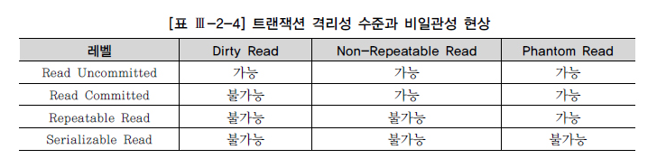

### A.C.I.D 란?

트랜잭션에서 중요시 여기는 4가지 요소이다.

1. Atomicity
2. Consistency
3. Isolation
4. Durability

앞글자를 따서 `ACID`라고 부른다.

#### 원자성 (Atomicity)

**하나의 트랜잭션 작업이 일부분만 실행되거나 중단되지 않는것을 보장해 주는 것**  
`All or Nothing`  
즉 작업단위에 대해 전체 성공 혹은 실패만을 보장하며 일부분만 작업하여 반영하지 않는다.

#### 일관성 (Consistency)

**트랜잭션이 작업이 성공적으로 완료가 되더라도 작업 이전과 같은 상태를 유지하는 것**  
예를 들어 정수 타입의 컬럼에 문자열 값이 들어가지 않는것을 보장하여 준다.  
데이터는 미리 정의된 정책에 대해서만 수정이 가능하며 무결성 원칙이 지켜지지 않는 작업은 바로 중단이 된다.

#### 격리성 (Isolation)

**Transaction 작업이 수행되고 있을때 다른 작업이 끼어들지 못하도록 보장해 주는 것**  
원칙적으로는 트랜잭션끼리는 서로 간섭이 없어야하지만 성능 이슈들이 많아서 유연하게 설정이 가능한 제약조건이다.

#### 지속성 (Durability)

**성공적으로 수행된 트랜잭션에 대해 영구히(Persistent) 반영되야 함**  
작업이 완료되어 `COMMIT` 까지 된 작업은 시스템 문제나 DB 일관성 체크 등을 하더라도 영구적으로 유지 되어야 한다.  
전형적으로 모든 트랜잭션은 로그로 남고 시스템 장애 발생 전 상태로 되돌릴 수 있다.

---

### Transaction의 정의

`Database의 데이터를 조작하는 작업의 단위(Unit Of Work)`  
하나의 `Work Flow`라고 생각하면 된다.

가장 많이 드는 예시는 은행에서 A가 B에게 송금을 하는 예시가 대표적.

A가 B에게 1000원을 송금한다고 가정시, 시나리오는 다음과 같다.

1. A의 계좌에서 1000원을 차감
2. B의 계좌에 1000원을 추가

이때 B의 계좌를 관리하는 은행에서 이유를 알 수 없는 오류로 추가가 되지 않는다면 A의 계좌에서 돈만 차감되게 되어 장애로 연결이 된다. 이를 보장하기 위해 모든 작업들은 트랜잭션 단위로 묶어서 처리가 필요하다.

---

### Isolation Level

`ACID`의 원칙을 너무 타이트하게 지키면 `동시성(Concurrency)`에 대한 퍼포먼스가 너무 떨어지기 때문에 **Isolation Level별**로 차등을 두어 동시성에 대한 이점을 가질 수 있게 하지만 문제가 발생할 가능성이 생기게 된다.

ANSI[^1]/ISO SQL Standard[^2] 에서 정의한 **Isolation Level**은 다음과 같다.

1. READ UNCOMMITTED
2. READ COMMITTED
3. REPEATABLE READ
4. SERIALIZABLE

#### READ UNCOMMITED

`SELECT` 쿼리 실행 시 다른 트랜잭션에서 `COMMIT` 되지 않은 데이터를 읽어올 수 있다.  
`COMMIT` 되지 않은 데이터를 읽는 현상을 **Dirty read**라고 말한다.  
`INSERT`만 진행되고 `ROLLABACK` 될 수도 있는, 즉 한번도 `COMMIT` 되지 않은 데이터를 읽을 수 있어 유의해야 한다.

(PostgreSQL에서는 `READ UNCOMMITTED` 레벨을 지원하지 않는다.)

#### READ COMMITTED

`COMMIT`이 완료된 데이터만 `SELECT` 쿼리 실행 시 보이는 수준을 보장하는 Level이며 **대부분의 DBMS에서 `READ COMMITTED`를 기본으로 설정**한다. **Dirty read**가 발생하지 않도록 보장한다.  
트랜잭션에서 `COMMIT`을 수행하지 않더라도 DB에 이미 값이 반영이 되어 있지 않은 상태라 `COMMIT` 이전의 데이터를 보장 받기 위해서는 `COMMIT` 되지 않은 쿼리를 복구하는 과정이 필요하게 된다. 즉 이 시점에서는 **Consistent Read**[^3]를 수행해야 함을 의미한다.

`READ COMMITED`의 문제는 하나의 트랜젝션 안에서 `SELECT`를 수행 할 때마다 데이터가 동일하다는 보장이 없다. 다른 트랜잭션에서 다른 데이터를 `COMMIT`했을 경우에 `COMMIT`된 데이터를 반환해 주는게 `READ COMMITED`의 특징이기 때문.  
위와 같은 이유로 `READ COMMITED`를 `Non-reapeatable Read`라고도 한다.

#### REPEATABLE READ

`Read Commited`와는 다르게 `Repeatable Read`는 **한 트랜잭션 안에서 반복해서 `SELECT`를 수행하더라도 읽어 들이는 값이 변화하지 않음을 보장**

처음으로 `SELECT`를 수행한 시간을 기록한 뒤 그 이후의 모든 `SELECT` 마다 해당 시점을 기준으로 **Consistent Read**를 수행하여 준다.
즉, **첫 `SELECT`시에 생성된 `SNAPSHOT`의 데이터를 읽어 오는 것**이다.

#### SERIALIZABLE

**모든 작업을 하나의 트랜잭션에서 처리하는 것과 같은 가장 높은 고립수준을 제공**

`Read Commited`, `Repeatable Read` 의 공통적 이슈는 `Phantom Read`[^4]가 발생한다는 점이다.

그와 다르게 `SERIALIZABLE` 에서는 쿼리가 전부 `SELECT ... FOR SHARE`로 자동으로 변경되어 `Reapeatable Read`에서 막을 수 없는 몇가지 상황을 방지할 수 있게 된다.

예를 들어 두개의 트랜잭션에 서로 업데이트를 하는 상황이라면,
(A-1) SELECT state FROM account WHERE id = 1;  
 (B-1) SELECT state FROM account WHERE id = 1;  
 (B-2) UPDATE account SET state = ‘rich’, money = money _ 1000 WHERE id = 1;  
 (B-3) COMMIT;  
 (A-2) UPDATE account SET state = ‘rich’, money = money _ 1000 WHERE id = 1;  
 (A-3) COMMIT;

1. **(A-1)**번 `SELECT` 쿼리가 `SELECT ... FOR SHARE`로 바뀌면서 id = 1인 row에 **S Lock**[^5]을 건다.
2. **(B-1)**번 `SELECT` 쿼리 역시 id = 1인 row 에 **S Lock**을 건다.
3. A와 B가 각각 **(A-2), (B-2)**의 `UPDATE` 쿼리를 실행하려 하면 row 에 **X Lock**[^6]을 시도한다.
4. 이미 해당 row 에는 **S Lock**이 걸려 있어 `DEADLOCK`상황에 빠진다.
5. 두 트랜잭션 모두 `DEADLOCK`으로 인한 Timeout으로 실패하여 데이터는 변경되지 않고 원래대로 남아있게 된다.

위 경우에서 알 수 있듯이 `SERIALIZABLE`은 데이터를 안전하게 보호할 수는 있지만 굉장히 쉽게 `DEADLOCK`에 걸릴 수 있다.  
따라서 `SERIALIZABLE`은 `DEADLOCK`이 걸리지 않는지 신중하게 계산하고 사용해야 한다.

---

### CRUD에 적절한 ISOLATION LEVEL

- `Read` 시에는 `REPEATBLE READ`
- `Create`, `Update`, `Delete` 할떄는 `SERIALIZABLE`

`UPDATE`나 `DELETE`는 **Consistent Read**의 적용을 받지 않는다는 것이다. 같은 WHERE 조건을 사용하더라도, 내가 수정하려고 `SELECT` 쿼리로 읽어온 row와 해당 row들을 수정하기 위해 `UPDATE` 쿼리를 날렸 을 때 실제로 수정되는 row가 다를 수 있다.

[참고 블로그](https://velog.io/@lsb156/Transaction-Isolation-Level#%EC%9B%90%EC%9E%90%EC%84%B1--atomicity-)

---

[^1]: ANSI (American National Standards Institute) : 미국 국립 표준 협회
[^2]: ISO ( International Organization for Standardization ) : 국제 표준화 기구
[^3]: read(=SELECT) operation을 수행할 때 현재 DB의 값이 아닌 특정시점의 DB SNAPSHOT을 읽어오는 것이다. 물론 이 SNAPSHOT은 COMMIT 된 변화만이 적용된 상태를 의미한다.
[^4]: UPDATE 후 COMMIT 하고 다시 조회를 했을 때 예상과는 다른 값이 보이거나 데이터가 유실된 경우
[^5]: (Shared lock, 공유 잠금) 읽기 잠금(Read lock)으로도 불린다. 어떤 트랜잭션에서 데이터를 읽고자 할 때 다른 shared lock은 허용이 되지만 exclusive lock은 불가하다. 즉 리소스를 다른 사용자가 동시에 읽을 수 있게 하되 변경은 불가하게 하는 것. (어떤 자원에 shared lock이 동시에 여러개 적용될 수 있다, 어떤 자원에 shared lock이 하나라도 걸려 있으면 exclusive lock을 걸 수 없다.)
[^6]: (Exclusive lock, 배타적 잠금) 쓰기 잠금(Write lock)이라고도 불린다. 어떤 트랜잭션에서 데이터를 변경(Write)하고자 할 때 해당 트랜잭션이 완료될 때까지 해당 테이블 혹은 레코드(row)를 다른 트랜잭션에서 읽거나 쓰지 못하게 하기 위해 Exclusive lock을 걸고 트랜잭션을 진행시키는 것이다. (Exclusive lock에 걸리면 shared lock을 걸 수 없다, exclusive lock에 걸린 테이블, 레코드 등의 자원에 대해 다른 트랜잭션이 exclusive lock을 걸 수 없다.) S lock, X lock 외의 RX, RS, S, SRX 등 다양한 Lock이 존재한다.
