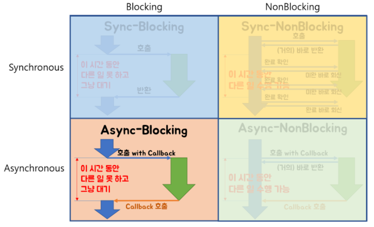

### Blocking/NonBlocking

> **Blocking/NonBlocking은 호출되는 함수가 바로 리턴하느냐 마느냐가 관심사**다.

호출된 함수가 바로 리턴해서 호출한 함수에게 제어권을 넘겨주고, 호출한 함수가 다른 일을 할 수 있는 기회를 줄 수 있으면 NonBlocking이다.

그렇지 않고 호출된 함수가 자신의 작업을 모두 마칠 때까지 호출한 함수에게 제어권을 넘겨주지 않고 대기하게 만든다면 Blocking이다.

### Synchronous/Asynchronous

> **Synchronous/Asynchronous는 호출되는 함수의 작업 완료 여부를 누가 신경쓰냐가 관심사**다.

호출되는 함수에게 callback을 전달해서, 호출되는 함수의 작업이 완료되면 호출되는 함수가 전달받은 callback을 실행하고, 호출하는 함수는 작업 완료 여부를 신경쓰지 않으면 Asynchronous다.

호출하는 함수가 호출되는 함수의 작업 완료 후 리턴을 기다리거나, 또는 호출되는 함수로부터 바로 리턴 받더라도 작업 완료 여부를 호출하는 함수 스스로 계속 확인하며 신경쓰면 Synchronous다.

#### NonBlocking-Sync


호출되는 함수는 바로 리턴하고, 호출하는 함수는 작업 완료 여부를 신경 쓰는것.

신경쓰는 방법은 `기다리거나, 물어보거나` 두가지가 있는데, NonBlocking 함수를 호출했다면 물어보는 일만 한다.

**즉, NonBlocking 메서드 호출 후 바로 반환 받아서 다른 작업을 할 수 있게 되지만, 메서드 호출에 의해 수행되는 작업이 완료된 것은 아니며, 호출하는 메서드가 호출되는 메서드 쪽에 작업 완료 여부를 계속 문의한다.**

**예시코드**

```java
Future ft =asyncFileChannel.read(...);

while(!ft.isDone()) {
  // isDone()은 asyncChannel.read() 작업이 완료되지 않았다면 false를 바로 리턴해준다.
  // isDone()은 물어보면 대답을 해줄 뿐 작업 완료를 스스로 신경쓰지 않고, isDone()을 호출하는 쪽에서 계속 isDone()을 호출하면서 작업 완료를 신경쓴다.
  // asyncChannel.read()가 완료되지 않아도 여기에서 다른 작업 수행 가능
  // 느낌상 jquery의 .done() 함수와 비슷한것 같다.
}

//작업이 완료되면 작업 결과에 따른 다른 작업 처리
```

참고로 위 코드는 NonBlocking-Sync라는 특성 이해에 집중할 수 있도록 간략화한 예제고, 실무적으로는 Future보다는 CompletableFuture를 쓰거나, Future를 쓴다면 위의 while 블록은 별도의 쓰레드로 빼서 실행하는 것이 좋다.

#### Blocking-Async

호출되는 함수가 바로 리턴하지 않고, 호출하는 함수는 작업 완료 여부를 신경쓰지 않는 것.



Blocking-Async는 별로 이점이 없어서 일부러 이 방식을 사용할 필요가 없긴 한데,
NonBlocking-Async를 추구하다가 의도하지 않게 Blocking-Async로 동작하는 경우가 있는데 **그 대표적 케이스가 `Node.js와 MySQL의 조합`** 이라고 한다.

Node.js 쪽에서 callback 지옥을 헤치면서 Async로 전진해와도, 결국 DB 작업 호출 시에는 MySQL에서 제공하는 드라이버를 호출하는데, 이 드라이버가 Blocking 방식이다.
당장 Node.js뿐만 아니라 Java의 JDBC도 마찬가지지만, 다만 Node.js가 싱글 쓰레드 루프 기반이라 멀티 쓰레드 기반인 Java의 Servlet 컨테이너보다 문제가 더 두드러져 보일 뿐이다.

> Blocking-Async는 별다른 장점이 없어서 일부러 사용할 필요는 없지만,
> **NonBlocking-Async 방식을 쓰는데 그 과정 중에 하나라도 Blocking으로 동작하는 놈이 포함되어 있다면 의도하지 않게 Blocking-Async로 동작**할 수 있다.
