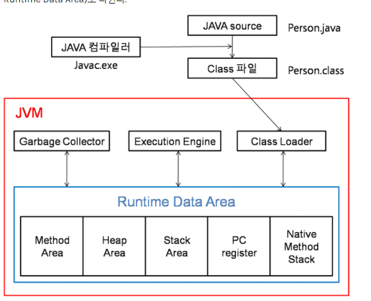
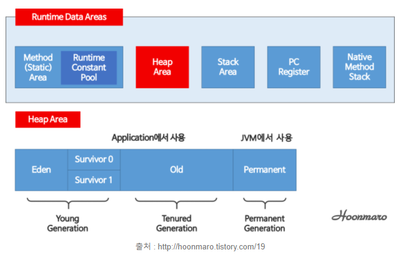

# [백기선의 live Study - 1주차](https://github.com/whiteship/live-study/issues/1)

## 목표
자바소스파일(.java)를 JVM으로 실행하는 과정 이해하기

## JVM이란 무엇인가

**자바 가상기계(JVM: Java Virtual Machine)** 의 약자이다.
자바 프로그램은 완전한 기계어가 아닌, 중간 단계의 바이트 코드이기 때문에 JVM을 통해 해석하고 실행할 수 있는 가상의 운영체제 역할을 한다.

운영체제별로 프로그램을 실행하고 관리하는 방법이 다르기 때문에 운영체제와 자바 프로그램 사이를 중계하는 JVM을 두어 **자바 프로그램이 여러 운영체제에서 동일한 실행 결과가 나오게 한다.**

하지만 JVM은 운영체제 종속적이라 운영체제에 맞게 설치해야 하는 점은 참고!

## 컴파일 & 실행하는 방법

1. 확장자가 `.java`인 소스 파일을 `javac.exe`로 컴파일 한다.
2. 컴파일 하면 확장자가 `.class`인 바이트 코드 파일이 생성된다. (바이트 코드는 반 기계어 상태로 컴퓨터가 읽기위해 변환 과정이 필요하다.)
3. `java.exe`로 `.class`파일을 실행하면 `JVM` 내에 있는 `class loader`가 프로그램 내의 `.class` 파일을 실행하며 메모리(Runtime Data Area)에 배치시킨다.
5. `byteCode Verifier`을 통해 가져오는 클래스들의 바이트코드들이 이상이 없는지, 자바의 보안규칙을 위배하지 않는지 검사한다.
6. `Execution Engine(실행엔진)` 안에는 `Interpreter`와 `JIT(Just-In-Time) 컴파일러`가 있는데, 해당 컴파일러들이 바이트 코드를 바이너리 코드로 변환해준다. (이때 변환된 바이너리 코드는 JVM의 클래스 영역에 저장된다.)
7. Runtime 실행된다.

C나 C++의 컴파일러는 한번의 컴파일링으로 실행 가능한 기계어가 만들어지지만, java는 JVM이 중간에 끼어있기 때문에 전자보다 속도가 조금 느리다.

## 바이트코드란 무엇인가

[`WORA(WORA: Write Once Run AnyWhere)`](https://zitto15.tistory.com/40)를 구현하기 위해 JVM은 사용자 언어인 자바와 기계어 사이의 중간 언어인 자바 바이트 코드를 사용한다.

`JVM`은 자바 바이트 코드를 실행하는 실행기이며, 자바 컴파일러는 C/C++등의 컴파일러처럼 고수준 언어를 기계어로 변환하는 것이 아니라 개발자가 이해하는 자바언어를 JVM이 이해하는 자바 바이트 코드로 번역한다.

따라서 자바 바이트 코드는 플랫폼 의존적인 코드가 없기 때문에 JVM(정확하게는 JRE)이 설치된 장비라면 어디든 실행 가능하며, 컴파일 결과물의 크기가 소스코드의 크기와 크게 다르지 않으므로 네트워크로 전송하여 실행하기도 쉽다.

이 자바 바이트 코드가 자바 코드를 배포하는 가장 작은 단위이다.

## JIT 컴파일러란 무엇이며 어떻게 동작하는지

위에서 만들어진 바이트 코드를 실행엔진에 의해 실행하게 되는데 해당 실행엔진에는 `인터프리터`, `JIT(Just-In-Time)` 두 가지방식이 있다.

> **인터프리터**
> 
> 바이트코드 명령어를 하나씩 읽어서 해석하고 실행한다. 하나씩 해석하고 실행하기 때문에 바이트코드 하나하나의 해석은 빠른 대신 인터프리팅 결과의 실행은 느리다는 단점을 가지고 있다. 흔히 얘기하는 인터프리터 언어의 단점을 그대로 가지는 것이다. 즉, 바이트코드라는 '언어'는 기본적으로 인터프리터 방식으로 동작한다.

위의 인터프리터의 단점을 보완하기 위해 도입된 컴파일러이다. 인터프리터 방식으로 실행하다가 적절한 시점에 바이트 코드 전체를 컴파일 하여 네이티브 코드로 변경 후, 해당 메서드를 더이상 인터프리팅 하지 않고 네이티브 코드로 직접 실행하는 방식이다.

네이티브 코드를 실행하는 것이 하나씩 인터프리팅 하는것 보다 빠르고, 캐시에 보관하기 때문에 한번 컴파일된 코드는 계속 빠르게 수행되게 된다.

## JVM 구성 요소

**JVM 구조**

**JVM 데이터 영역**

메모리 영역은 총 6개 영역으로 나누어지며, 꼭 알아야 할 부분은 하단 4가지이다.

1. **메소드 영역(스태틱 영역)**
   - `main()` 메서드 실행 전 java.lang 패키지와 import된 패키지를 이 영역에 배치한다. 
   - 프로그램 상의 모든 클래스와 인터페이스 또한 이 영역에 배치한다.

2. **스택 영역**
   - 메서드가 실행되면 스택 영역에 해당 메서드에 대한 영역이 하나 생기는데, 이 영역에서 해당 메서드에서 사용하는 값들을 저장한다.
   - 지역변수, 매개변수, 리턴값 등이 해당되는데, 만약 `값`이 아닌 `참조`일 경우에는 힙 영역에 있는 인스턴스의 주소값을 가리키게 된다.

3. **힙 영역**
   - `new`를 통해 생성된 객체와 배열의 인스턴스를 저장하는 공간이다.
   - 해당 인스턴스는 내부에 객체에서 사용하는 값과 메서드 명을 저장하며, 각 인스턴스는 각자의 힙 영역을 갖게 된다.
   - 해당 영역은 가비지 컬랙션의 대상이다.
   - 해당 영역에 생성된 객체와 배열은 스택 영역의 변수나 다른 객체의 필드에서 참조한다.

4. **PC 레지스터**
   - 쓰레드가 생성될 때마다 생성되는 영역으로 `program Counter`, 즉 현재 쓰레드가 실행되는 부분의 주소와 명력을 저장하고 있는 영역(*CPU의 레지스터와 다름)

쓰레드가 생성되었을 때 기준으로 메서드 영역과 힙 영역을 모든 쓰레드가 공유하고, 스택 영역과 PC레지스터 등은 각각의 쓰레드마다 생성되고 공유되지 않는다.

## JDK와 JRE의 차이

1. **JDK(Java Development Kit)**
   - Java용 SDK(Software Development Kit)이다.
   - Java 개발자가 Java기반 프로그램을 개발할 수 있도록 컴파일러, 툴 등을 제공한다.

2. **JRE(Java Runtime Environment)**
   - Java 프로그램을 실행시키기 위한 환경을 제공한다. 즉, Java 언어로 만들어져 컴파일 된 프로그램을 실행하려면 JRE는 설치되어 있어야 한다.

- JDK = JRE + 개발툴 + Java 컴파일러
- JRE = JVM, 라이브러리, 기타 애플릿이나 어플리케이션 구동 요소

---

#### 출처

[JVM 동작원리 및 기본개념](https://steady-snail.tistory.com/67)

[자바 실행단계 설명 글](https://homoefficio.github.io/2019/01/31/Back-to-the-Essence-Java-%EC%BB%B4%ED%8C%8C%EC%9D%BC%EC%97%90%EC%84%9C-%EC%8B%A4%ED%96%89%EA%B9%8C%EC%A7%80-2/)

[네이버 D2 Java Internal](https://d2.naver.com/helloworld/1230)

[JVM 구조](https://m.blog.naver.com/PostView.nhn?blogId=writer0713&logNo=221137837754&proxyReferer=https:%2F%2Fwww.google.com%2F)

[JVM에서 일어나는 과정을 설명해주세요](https://jeong-pro.tistory.com/148)