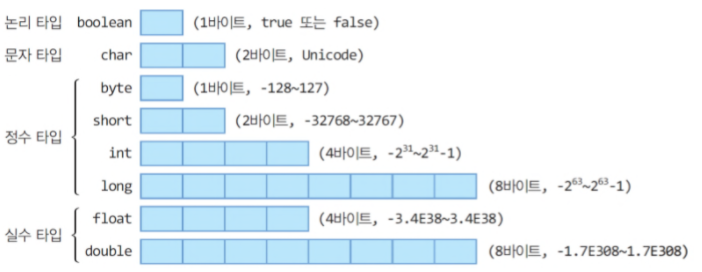
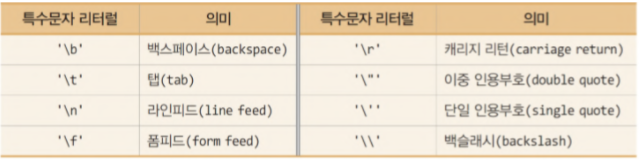

# [백기선의 live Study - 2주차](https://github.com/whiteship/live-study/issues/2)

## 목표
자바의 프리미티브 타입, 변수 그리고 배열을 사용하는 방법을 익힙니다.

## 기본형 타입(Primitive type) 종류와 값의 범위 그리고 기본 값

- 총 8가지이다.
- 기본값이 있기 때문에 `Null`이 존재하지 않는다. 기본형 타입에 `Null`을 넣고 싶으면 `래퍼 클래스`를 사용하자.
- **실제 값**을 저장하는 공간으로 `스택(Stack) 영역`에 저장된다.
- 컴파일 시점에 담을 수 있는 크기를 벗어나면 에러를 발생시키는 컴파일 에러가 발생한다.



형식 | 타입 | 할당 크기 | 기본값 | 표현 범위
---------|----------|---------|--|--
논리형 |  boolean | 1 byte | false | true, false
정수형 | byte | 1 byte | 0 | -128 ~ 127
정수형 | short | 2 byte | 0 | -32,768 ~ 32,767
정수형 | int | 4 byte | 0 | -2,147,483,648 ~ 2,147,483,647
정수형 | long | 8 byte | 0L | -9,223,372,036,854,775,808 ~ 9,223,372,036,854,775,807
실수형 | float | 4 byte | 0.0F |  (3.4 X 10-^38^) ~ (3.4 X 10^38^) 의 근사값
실수형 | double | 8 byte | 0.0 | (1.7 X 10-^308^) ~ (1.7 X 10^308^) 의 근사값
문자형 | char | 2 byte (유니코드) | '\u0000' | 0 ~ 65,535

## 기본형 타입(Primitive type)과 참조형 타입(Reference type)

- 기본형 타입을 제외한 타입들은 모두 참조형 타입이다.
- 빈 객체를 의미하는 `Null`이 존재한다.
- 값이 저장되어 있는 곳의 **주소값**을 저장하는 공간으로 `힙 영역`에 저장된다.
- 문법상에는 에러가 없지만 실행 시켰을때 에러가 나는 런타임 에러가 발생한다.


타입 | 예시 | 기본값 | 할당 크기
---------|----------|---------| --
 배열(Array) | int[] arr = new int[5]; | Null | 4 byte(객체의 주소값)
 열거(Enum) |  | Null | 4 byte(객체의 주소값)
클래스(Class) | String str = "test";<br> Student min = new Student(); | Null | 4 byte(객체의 주소값)
인터페이스(Interface) | | Null | 4 byte(객체의 주소값)

## 리터럴

- 리터럴은 데이터 그 자체를 뜻한다.
- 변수에 넣는 변하지 않는 데이터를 의미한다.

```java
int a = 1;
```

위에서 `a` 는 변수이고, `1`은 리터럴이다.


### 정수 리터럴

```java
int a = 15; // 10진수 15
int b = 015; // 8진수 -> 십진수 13
int c = 0x15; // 16진수 -> 십진수 21
int d = 0b0101; // 2진수 -> 십진수 5
```

- long 타입 리터럴은 숫자뒤에 **L** 또는 **l**을 붙여 표시한다.(`long a = 26L;`)

### 실수리터럴

```java
double f = 0.1234;
double g = 1234E-4;
```

- 숫자뒤에 **f(float)**나 **d(double)**을 명시적으로 붙이기도 한다.
(float 같은 경우는 f를 꼭 붙여줘야하고 double은 생략 가능)

```java
float h = 0.1234f;
double i = .1234D;
```

### 문자 리터럴

- `싱글 코텐션('')`으로 문자를 표현한다.

```java
char a = 'H';
char b = '한';
char c = \uae00; // \u다음에 4자리 16진수로, 2바이트의 유니코드
```

- **특수문자 리터럴**


### 문자열 리터럴

- 문자열은 기본타입이 아니며, `더블 코텐션("")`으로 표현한다.

```java
String text = "JAVA";
```

### 논리 타입 리터럴 및 기타 리터럴

- boolean타입 변수에 치환하거나 조건문에 이용된다.

```java
boolean a = true;
boolean b = 10 > 0; //true
boolean c = 0;
```

- null 리터럴은 레퍼런스에 대입해서 사용된다. 래퍼 클래스에 사용 가능.

```java
int a = null; //에러
String str = null;
```

## 변수 선언 및 초기화하는 방법

- 변수를 선언하는 방식은 `int a;` 등으로 선언한다. 처음 `자료형`을 선언하고, 이후 `변수명`을 선언한다.

- 변수를 초기화 하는 방식은 `a = 0;` 등으로 선언한다. 초기화를 원하는 `변수명` 뒤에 `값`을 적어주는데 그 사이에 `=`을 사용하여 초기화 시킨다.

변수의 초기화는 경우에 따라 필수적, 선택적일 수 있다. **멤버변수는 초기화를 하지 않아도 변수 타입에 맞는 기본값으로 초기화가 이루어지지만 지역변수는 자용하기 전에 반드시 초기화가 이루어져야한다.**

```java
class InitTest { 
    int a; // 인스턴스 변수 (멤버변수)
    int b = a; // 인스턴스 변수 (멤버변수)

    void method() {
        int c; // 지역변수
        int d = c; // 에러, 지역변수를 초기화 하지 않고 바로 사용하였기 때문.
    }
}
```

**변수의 초기화 방식에는 3가지가 있다.**

1. **명시적 초기화**  
    변수 선언과 동시에 초기화 하는것
    ```java
    class Car{
        int door = 4; //기본형변수 초기화
        Engine e = new Engine(); //참조형변수 초기화
    }
    ```
2. **생성자**
3. **초기화 블럭**
   ```java
   class InitBlock {
       static { } //클래스 초기화 블럭
       { } //인스턴스 초기화 블럭
   }
   ```
   클래스 초기화 블럭은 `클래스 변수` 초기화에 사용하며, 클래스가 메모리에 처음 로딩될 때 한번만 수행한다.  
   인스턴스 초기화 블럭은 `인스턴스 변수` 초기화에 사용되며, 생성자와 같이 인스턴스를 생성할 때 마다 수행한다.

   인스턴스 변수의 초기화는 주로 생성자를 사용하기 때문에, 인스턴스 초기화 블럭은 잘 사용되지 않는다.

- **멤버변수의 초기화 시기와 순서**
  - 클래스 변수
    - 초기화 시점 : 클래스가 처음 로딩될 때 딱 한번
    - 초기화 순서 : 기본값 -> 명시적 초기화 -> 클래스 초기화 블럭
  - 인스턴스 변수
    - 초기화 시점 : 인스턴스가 생성될 때마다 각 인스턴스별로 초기화
    - 초기화 순서 : 기본값 -> 명시적 초기화 -> 인스턴스 초기화 블럭 -> 생성자

## 변수의 스코프와 라이프타임


### 스코프

동일한 프로그램 내에서 여러가지 이유로 변수명이 충돌할 가능성이 있다. 그를 해결하기 위해 고안된 것이 `Scope`이다.

자바에서는 `{}` 내에서 하나의 스코프 블록이 형성된다.

```java
class InitTest { 
    static int ax; //클래스 변수

    int a; // 인스턴스 변수 (멤버변수)
    int b = a; // 인스턴스 변수 (멤버변수)

    void method() {
        int c; // 지역변수
        int d = c; // 에러, 지역변수를 초기화 하지 않고 바로 사용하였기 때문.
    }
}
```

- **클래스변수**
  - 클래스 전체에서 사용
- **인스턴스 변수**
  - 클래스 전체에서 사용(static 제외)
- **지역변수**
  - 선언된 블록 내


지역변수의 경우 선언된 영역 스코프(`{}`, `()`)을 벗어나면 소멸된다.

### 라이프타임

- **클래스변수**
  - 프로그램이 꺼지기 전까지 혹은 클래스가 메모리에 남아있는 동안
- **인스턴스 변수**
  - 객체가 메모리에 남아있는 동안
- **지역변수**
  - 선언된 블록을 벗어날 때까지

## 타입 변환, 캐스팅 그리고 타입 프로모션

자바에서는 두 종류의 타입 변환이 있다.

1. 자동 타입 변환(묵시적) - 타입프로모션
2. 강제 타입 변환(명시적) - 캐스팅

- **타입별 크기 순서(byte)**
    `byte (1) < short (2) < int (4) < long (8) < float (4) < double (8)`

### 자동 타입 변환 (프로모션)

- 프로그램 실행도중 자동으로 타입 변환이 일어나는 경우이며, **작은 크기를 가진 타입이 큰 크기를 가지는 타입에 저장될 때 발생**한다.

```java
public class Example {
    public static void main(String[] args) {
        char charVal = '가';
        int intVal = charVal; //char -> int
        System.out.println("가의 유니코드 : "+intVal); //가의 유니코드 : 44032

        intVal = 500;
        long longVal = intVal; //int -> long
        System.out.println(longVal); // 500

        intVal = 200;
        double doubleVal = intVal;
        System.out.println(doubleVal); //200.0
    }
}
```

### 강제 타입 변환 (캐스팅)

큰 크기 타입은 작은 타입으로 자동 타입 변환이 불가하다.  
하지만 예를 들면 강제로 int타입의 1 byte를 잘라서 byte 타입 변수에 저장할 수 있다. (나머지 3 byte는 버려진다.)

```java
public class Example {
    public static void main(String[] args) {
        int intVal = 44032;
        char charVal = (char)intVal;
        System.out.println(charVal); // 44032에 해당되는 유니코드 '가' 출력

        int intVal = 'A'; //65저장
        char charVal = (char)intVal; //65에 해당되는 문자 저장
        System.out.println(charVal); //저장된 문자 출력

        long longVal = 500;
        intVal = (int)longVal;
        System.out.println(intVal); // 500 -> 1byte 이내라 손실이 없는 다행인 경우.

        double doubleVal = 3.14; 
        intVal = (int)doubleVal; 
        System.out.println(intVal); // 정수부분인 3 출력
    }
}
```

**강제 타입 변환에서 값의 손실이 일어나지 않도록 주의해야한다**

```java
// 값의 범위 체크 (값 누락 체크)
public class CheckValBeforeCasting { 
    public static void main(String[] args) {
        int i = 128; //변환 대상 

        if ( (i < Byte.MIN_VALUE) || (i > Byte.MAX_VALUE) ) { // (i<-128 || i>127) 과 동일 
         System.out.println("byte 타입으로 변환 할 수 없습니다."); 
         System.out.println("값을 다시 확인하세요"); 
        } else { 
             byte b = (byte) i; 
             System.out.println(b); 
        } 
    } 
}
```

또한 정수타입을 실수타입으로 변환할 때 **정밀도 손실**을 피해야 한다.
```java
public class FromIntToFloat {
    public static void main(String[] args) {
        int num1 = 123456780;
        int num2 = 123456780;

        float num3 = num2; //int 변수 num2를 float로 자동 변환
        num2 = (int)num3; //float 변수를 int로 강제 변환

        int result = num1 - num2;

        System.out.println(result); // -4 가 출력된다!?
    }
}
```

결과값이 0이 나와야하지만 -4가 출력되었다.

float 형의 가수 부분은 23비트 이므로, 23비트로 표현할 수 없어서 근사치로 변환된다.(정밀도 손실 발생)

해결법은 double 타입을 사용하면 된다!

### 연산식에서의 자동 타입 변환과 강제 타입 변환

서로 다른 타입의 피연산자가 있을 경우 **두 연산자 중 크기가 큰 타입으로 자동 타입 변환된 후 연산을 수행**한다.

```java
public class OperationPromotionExam { 
    public static void main(String[] args) {
        byte byteVal1 = 10;
        byte byteVal2 = 20; // byte byteVal3 = byteVal1 + byteVal2; 컴파일 에러 -> 연산결과가 int형 이기 때문!
        
        int intVal1 = byteVal1 + byteVal2;
        System.out.println(intVal1);

        char charVal1 = 'A';
        char charVal2 = 1; // char charVal3 = charVal1 + charVal2;  -> 컴파일 에러 연산결과가 int형 이기 때문! 

        int intVal2 = charVal1 + charVal2; // 65 + 1 
        System.out.println("유니코드 = " +intVal2); // 66 
        System.out.println("출력문자 : "+(char)intVal2); // B 
        
        int intVal3 = 10; 
        int intVal4 = intVal3 / 4; // int형 연산, 소수점 버려짐 

        System.out.println(intVal4); // 2 

        int intVal5 = 10; // int intVal6 = 10 / 4.0; 컴파일 에러 연산결과가 double 이기 때문 
        
        double doubleVal = intVal5 / 4.0;
        System.out.println(doubleVal); // 2.5 
    } 
}
```

자바는 정수 연산 시 int 타입, 실수 연산시 double 타입을 기본으로 한다.


#### 연산 시 자동 타입 변환 정리
  - 정수와 실수 연산 = 실수형 타입 (double)
  - 정수와 정수 연산 = int 타입
  - 실수와 실수 연산 = double 타입
  - 큰 타입과 작은 타입 연산 = 큰 타입
---

## 1차 및 2차 배열 선언하기

배열을 선언하는 방법은 두가지가 있다.
1. `타입 [] 변수;`
2. `타입 변수 [];`

### 1차원 배열
```java
/* 변수명은 arr로 통일 */

//int 타입 배열 선언
int [] arr;
int arr[];

//배열 생성후 초기화하면 배열의 주소가 할당된다.
int[] arr = new int[8]; //초기값 0
String[] arr = new String[8]; //초기값 ""

//배열 선언만 해놓고 나중에 초기화를 시킬수도 있다.
int[] arr;
arr = new array[8];

//배열에 특정 값 대입하며 선언
int[] arr = {1, 2, 3, 4};
int[] arr = {"a", "b", "c"};

//배열을 모두 1로 초기화
Arrays.fill(arr, 1);

//길이가 8인 자동차 객체배열 선언
Car[] car = new Car[8]; //각 배열엔 NULL값만 존재

car[0] = new Car(); //Car 클래스를 초기화 시켜주어 주소값을 설정
```

### 2차원 배열


```java
/* 변수명은 arr로 통일 */

//int 타입 배열 선언
int [][] arr;
int arr[][];

//배열 생성후 초기화하면 배열의 주소가 할당된다.
int[][] arr = new int[8][8]; //초기값 0
String[] arr = new String[8][8]; //초기값 ""

//배열 선언만 해놓고 나중에 초기화를 시킬수도 있다.
int[][] arr;
arr = new array[8][8];

//배열에 특정 값 대입하며 선언
int[] arr = { {1, 2},
              {3, 4} };
int[] arr = { {"a", "b"}, 
              {"c", "d"} };

//배열을 모두 1로 초기화
for(int a[] : arr) {
    Arrays.fill(a, 1);
}

//길이가 8인 자동차 객체배열 선언
Car[] car = new Car[8][8]; //각 배열엔 NULL값만 존재

car[0][0] = new Car(); //Car 클래스를 초기화 시켜주어 주소값을 설정
```

## 타입 추론, var

### 타입추론  

`java 7`부터 지원된 기능이며, 코드 작성 당시 타입이 정해지지 않았지만, 컴파일러가 그 타입을 유추하는 것이다.

자바는 일반 변수에 대한 타입 추론이 지원되지 않기 때문에, `Generic`과 `Lambda`에 대한 타입 추론을 말한다.

### var

`java 10`부터 타입 추론을 지원하는 `var` 키워드가 추가되었다고 한다. 이 키워드는 `local variable` 이면서 선언과 동시에 초기화가 필수적으로 요구된다.

`컴파일러는 오른쪽에 초기화 값으로 제공되는 것을 통해 타입을 유추한다.`

```java
//java 9 이하
String text = "Hello";

//java 10 이상
var text = "Hello"; //String으로 타입 자동 추론
```

### 출처

[[JAVA] 변수의 초기화](https://whatisthenext.tistory.com/30)

[Scope and lifetime of variables in Java?](https://www.tutorialspoint.com/scope-and-lifetime-of-variables-in-java)

[3. Java 자바 - 자동 타입 변환, 강제 타입 변환](https://kephilab.tistory.com/27)

[[Java] 배열의 여러가지 선언 및 초기화 방법](https://coding-factory.tistory.com/253)

[자바(Java)〃배열(2) 다차원 배열(2차원 배열) + 구구단 예제](https://hunit.tistory.com/164)

[Java Lambda (2) 타입 추론과 함수형 인터페이스](https://futurecreator.github.io/2018/07/20/java-lambda-type-inference-functional-interface/)