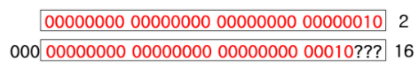
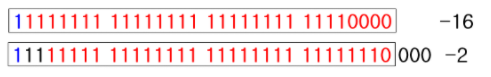
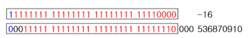
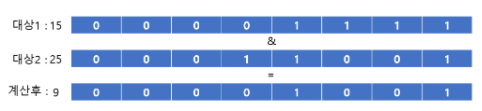
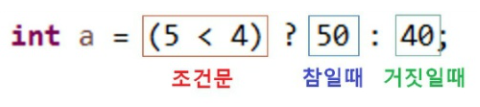
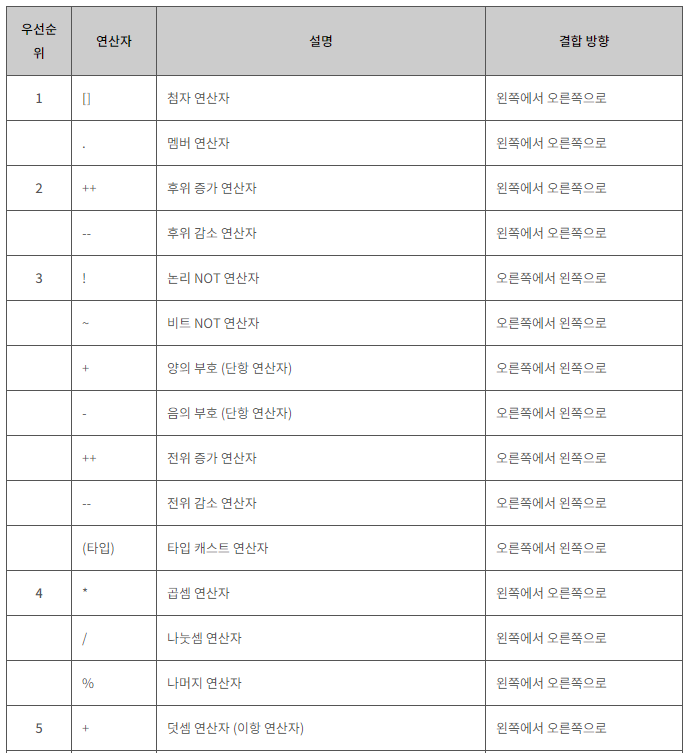
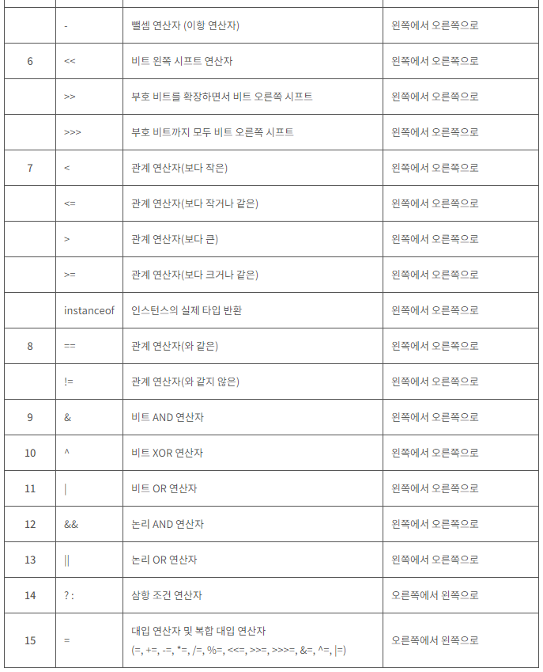

# [백기선의 live Study - 3주차](https://github.com/whiteship/live-study/issues/3)

## 목표
자바가 제공하는 다양한 연산자를 학습하세요.

## 산술연산자

사칙연산을 다루는 연산자이다. 모두 두개의 피연산자를 가지는 이항 연산자이며, 피연산자들의 결합 방향은 왼쪽에서 오른쪽이다.


산술연산자 | 설명 
---------|----------
 \+ | 왼쪽의 피연산자에 오른쪽의 피연산자를 더함.
 \- | 왼쪽의 피연산자에서 오른쪽의 피연산자를 뺌. 
 \* | 왼쪽의 피연산자에 오른쪽의 피연산자를 곱함. 
\/ | 왼쪽의 피연산자를 오른쪽의 피연산자로 나눔.
\% | 왼쪽의 피연산자를 오른쪽의 피연산자로 나눈 후, 그 나머지를 반환함.

```java
int num1 = 8, num2 = 4;

System.out.println("+ 연산자에 의한 결과 : "+ (num1 + num2)); //12
System.out.println("- 연산자에 의한 결과 : "+ (num1 - num2)); //4
System.out.println("* 연산자에 의한 결과 : "+ (num1 * num2)); //32
System.out.println("/ 연산자에 의한 결과 : "+ (num1 / num2)); //2
System.out.println("% 연산자에 의한 결과 : "+ (num1 % num2)); //0
```

## 비트 연산자

### 비트 이동 연산자

연산식 | 설명 
---------|---------
 x << y |  정수 x의 각 비트를 y만큼 왼쪽으로 이동(빈자리는 0으로 채움)
 x >> y | 정수 x의 각 비트를 y만큼 오른쪽으로 이동(빈자리는 정수 a의 최상위 부호비트와 같은값으로 채움)
 x >>> y | 정수 x의 각 비트를 y만큼 오른쪽으로 이동(빈자리는 0으로 채움) 

#### 2 << 3


해당 연산은 **2**를 **32비트로 분해**한 다음 왼쪽으로 3비트를 이동시키는 연산이다.  
왼쪽 3비트는 밀려서 버려지게 되고 오른쪽에는 0으로 채워지기때문에, **2진수로 표현된 2를 왼쪽으로 3칸 이동시키면 16이 된다.**

#### -16 >> 3



비트를 오른쪽으로 3비트 이동할 때 맨 오른쪽 3비트는 밀려서 버려지게 되고 맨 왼쪽에는 최상위 부호비트와 동일한 값으로 채워지게 된다.
**현재 음수이기 때문에 좌측에 1이 채워져 -16은 -3이 된다.**

#### -16 >>> 3



`>>>` 연산은 오직 `java`에만 있는 연산이며 `>>`과 기본 원리는 같으나 **최상위 부호비트와 상관없이 무조건 0으로 채워지게 된다.**

```java
System.out.println("2 << 3 = " + (2<<3)); //16
System.out.println("16 >> 3 = " + (16>>3)); //2
System.out.println("-16 >> 3 = " + (-16>>3)); //-2
System.out.println("-16 >>> 3 = " + (-16>>>3)); //536870910
```

### 비트 논리 연산자

비트논리 연산자는 대상이 `boolean` 타입일 경우 일반 논리 연산자로 활용되지만, 대상이 정수형일 경우에는 아래의 표와 같이 비트논리 연산자로 활용된다. 비트연산은 두 값을 비트단위로 나열한 뒤 각 자릿수를 비트 연산자로 연산한다.


연산자 | 논리 | 설명
---------|----------|---------
 & | AND | 두 비트 모두 1일 경우에만 연산결과가 1
 | | OR | 두 비트 중 하나만 1일 경우에만 연산결과가 1
 ^ | XOR | 두 비트중 하나는 1이고 다른 하나가 0일 경우에만 연산결과가 1
 ~ | NOT | 비트 반전(보수)

#### 비트연산 예시 (&)


2진수로 표현된 2개의 피연산자를 AND 연산하여 결과를 나타낸다. 2진수로 표현된 두 비트가 모두 1일 경우에만 연산결과가 1로 표현됨.

다른 비트연산자도 로직은 동일.

```java
System.out.println("15 & 25 = " + (15 & 25)); //9
System.out.println("15 | 25 = " + (15 | 25)); //31
System.out.println("15 ^ 25 = " + (15 ^ 25)); //22
System.out.println("~25 = " + (~25)); //-26
```

## 관계연산자

비교 연산자라고도 하며 부등호로 표현한다. 결과는 `true` 혹은 `false`인 `boolean`형으로 반환된다. 제어문에서 많이 사용한다.

연산자 | 기능 
---------|----------
 \> | 왼쪽 항이 크면 참, 아니면 거짓
 < | 왼쪽 항이 작으면 참, 아니면 거짓 
 \>= | 왼쪽 항이 오른쪽 항보다 크거나 같으면 참, 아니면 거짓
 <= | 왼쪽 항이 오른쪽 항보다 작거나 같으면 참, 아니면 거짓
 == | 두 개 항의 값이 같으면 참, 아니면 거짓
 != | 두개 항이 다르면 참, 아니면 거짓 

 ```java
System.out.println(3 > 5); //false
System.out.println(3 < 5); //true
System.out.println(3 >= 5); //false
System.out.println(3 <= 5); //true
System.out.println(3 == 5); //false
System.out.println(3 != 5); //true
```

## 논리연산자

비트 논리연산자와 비슷하나 일반 논리연산자는 논리연산자를 두개 사용한다. 관계연산자와 같이 사용되는 경우가 많으며 `boolean` 타입으로 결과값이 반환된다.


연산자 | 기능 
---------|----------
 &&(논리곱) | 두 항이 모두 참인 경우에는 결과값이 참, 아니면 거짓
 \|\|(논리합) | 두 항중 하나의 항만 참이면 결과값은 참, 아니면 거짓 
 !(부정) | 단항 연산자이며, 참일경우엔 거짓으로 바꾸고 거짓일 경우에는 참으로 바꿈

```java
System.out.println(true && true); //true
System.out.println(true && false); //false
System.out.println(true || true); //true
System.out.println(true || false); //true
System.out.println(!true); //false
``` 

해당 논리연산자에서 중요한 점은 A,B라는 각 조건식이 있을경우 `A && B` 에서 A가 `false`일 경우, B를 실행하지 않고 바로 지나간다.
`A || B` 일 경우, A가 `true` 일 경우에는 B를 실행하지 않고 넘어간다. A가 `false`일 경우에는 `B`를 실행한다.

## instanceof

객체 타입을 확인하는데 사용한다. 주로 부모 객체인지 자식 객체인지 확인하는데 사용한다. 반환값은 `boolean` 값이다.

```java
class InstanceofTest { 
    public static void main(String args[]) { 
        Engine e = new Engine(); 
        if(e instanceof Engine) { 
            System.out.println("엔진 인스턴스입니다."); 
        } 
        
        if(e instanceof Car) { 
            System.out.println("자동차 인스턴스입니다."); 
        } 
        
        if(e instanceof Object) { 
            System.out.println("오브젝트 인스턴스입니다."); } 
        } 
    } // class 
    
    class Car {} 
    
    class Engine extends Car {}

    //결과 :
    //엔진 인스턴스입니다.
    //자동차 인스턴스입니다.
    //오브젝트 인스턴스입니다.
```

생성된 instance는 `Engine` 인스턴스이지만, 해당 인스턴스는 `Car` 인스턴스의 자손 클래스이고, `Object` 인스턴스의 자손클래스이다.
하여 `Engine` 인스턴스는 `Object`, `Car`의 인스턴스를 포함하는 셈이기 때문에 모두 true의 결과를 얻었다.

**`instanceof` 연산의 결과가 `true`라는 것은 검사한 타입으로 형변환을 해도 아무런 문제가 없다는 뜻이다.**

## assignment(=) operator(자바 할당연산자)

대입 연산자라고도 하며, 변수에 값을 대입할때 사용하는 이항 연산자이다.


연산자 | 기능 
---------|----------
 = | 좌측의 어떠한 변수에 우측의 값을 대입시킨다. 
+= | 좌측의 어떠한 변수에 우측의 값을 더한 값을 대입시킨다. 
-= | 좌측의 어떠한 변수에 우측의 값을 뺀 값을 대입시킨다. 
*= | 좌측의 어떠한 변수에 우측의 값을 곱한 값을 대입시킨다. 
/= | 좌측의 어떠한 변수에 우측의 값을 나눈 값을 대입시킨다. 
%= | 좌측의 어떠한 변수에 우측의 값을 나눈 나머지 값을 대입시킨다. 

```java
int value = 10; //value == 10
value += 1; //value == 11
value -= 1; //value == 10
value *= 2; //value == 20
value /= 2; //value == 10
value %= 2; //value == 0
```

## 화살표(->) 연산자

람다 표현식을 나타낼때 화살표 연산자를 사용한다.

`(매개변수 목록) -> { 함수 몸체 }`

식으로 사용하며 유의해야 할 점은 다음과 같다.

1. 매개변수의 타입을 추론할 수 있는 경우엔 타입 생략 가능
2. 매개변수가 하나인 경우에는 ()(괄호) 생략 가능
3. 함수의 몸체가 하나의 명령문만으로 이루어진 경우에는 {}(중괄호) 생략 가능 (이때, 세미콜론은 붙이지 않음)
4. 함수의 몸체가 하나의 return 문으로만 이루어진 경우에는 {}(중괄호) 생략 불가
5. return문 대신 표현식 사용가능하며, 이때 반환값은 표현식의 결과값이 된다. (이때, 세미콜론은 붙이지 않음)

```java
//두개의 동일한 min 메서드
//1.메서드
int min(int x, int y) {
    return x < y ? x : y;
}

//2.람다 표현식
(x,y) -> x < y ? x : y;
```

```java
//스레드 생성시
//1.전통적인 방법
new Thread(new Runnable() {
    public void run() {
        System.out.println("전통적인 방식의 일회용 스레드 생성");
    }
}).start();

//2.람다 표현식
new Thread(()->{
    System.out.println("람다 표현식을 사용한 일회용 스레드 생성");
}).start();
```

위 예제처럼 메소드를 람다 표현식으로 표현하면, 클래스를 작성하고 객체를 생성하지 않아도 메소드를 사용할 수 있다. 람다 표현식은 `익명 클래스`와 같다고 할 수 있다.

## 3항 연산자

위에서 살짝 스쳐지나가듯이 나왔던 연산자인데, 조건문을 사용하여 코딩할 경우 의미없이 코드 길이가 길어지기 마련인데 해당 `3항연산자`를 사용하여 획기적으로 줄여줄 수 있다.



`(조건문) ? 참 : 거짓`

위와 같은 방식으로 사용하며, 괄호안의 조건이 참일 경우 50이 담기게 되고 거짓일 경우에는 40이 담기게 된다.

```java
//전통적인 방식의 if,else
int a;

if(5 < 4) {
    a = 50;
} else {
    a = 40;
}
System.out.println(a); //결과 = 40 

//삼항연산자
int b = (5 < 4) ? 50 : 40;
System.out.println(b); //결과 = 40
```

**사용에 주의할 점이 있다.**
1. 3항연산자를 사용하여 코드의 라인이 줄어들었다고 컴파일 속도가 빨라지는 것은 아니다.
2. 삼항연산자를 중복해서 처리할 경우. 가독성이 떨어질 수 있으므로 중복처리는 피하는것이 좋다.

## 연산자 우선순위
연산자의 우선순위는 수식 내에 여러 연산자가 함께 등장할 때, 어느 연산자가 먼저 처리될 것인가를 결정한다.




## (optional) Java 13. switch 연산자

switch가 일반 switch이지 왜 `java13` `switch`지? 하고 검색해본 결과 확실히 달랐다. 아니 달라졌다!

- 전통적인 `switch`
    ```java
    int mode = "a";
    int value;
    switch(mode) {
        case "a": case "b":
            value = 1;
        break;

        case "c":
            value = 2;
        break;

        default:
            value = 3;
        break;
    }
    ```

- `JAVA12` - 콤마(,) 구분 `Switch`
    ```java
    int mode = "a";
    int value;
    switch(mode) {
        case "a", "b": //이부분!
            value = 1;
        break;

        case "c":
            value = 2;
        break;

        default:
            value = 3;
        break;
    }
    ```

- `JAVA12` - break로 값 반환 가능 **(현재 `java13`에서의 `yield`로 대체됨)**
    ```java
    int mode = "a";
    int value = switch(mode) { //이부분!
        case "a", "b": 
        break 1; //이부분!

        case "c":
        break 2;

        default:
        break 3;
    }
    ```

- `JAVA12` - 화살표 함수로 표시 가능 (break 없어도 됨)
    ```java
    int mode = "a";
    int value = switch(mode) {
        case "a", "b" -> 1 //이부분!

        case "c" -> 2

        default -> {
            //여기서 무언가 더 해보자.
            System.out.println("멀티라인 지원해요!");
            yield 3;
        }
    }
    ```

- `JAVA13` - `yield`를 통해 값 반환
    ```java
    int mode = "a";
    int value = switch(mode) {
        case "a", "b":
            yield 1 //이부분!

        case "c":
            yield 2

        default:
            //여기서 무언가 더 해보자.
            System.out.println("멀티라인 지원해요!");
            yield 3;
    }
    ```

---

### 출처
[[Java] 연산자 - 관계, 논리, 조건, 비트 연산자](https://velog.io/@foeverna/Java-%EC%97%B0%EC%82%B0%EC%9E%90-%EA%B4%80%EA%B3%84-%EB%85%BC%EB%A6%AC-%EC%A1%B0%EA%B1%B4-%EB%B9%84%ED%8A%B8-%EC%97%B0%EC%82%B0%EC%9E%90)

[람다 표현식](http://www.tcpschool.com/java/java_lambda_concept)

[[Java13]자바13 변경사항](https://blog.naver.com/PostView.nhn?blogId=kgw1988&logNo=221678438564&parentCategoryNo=&categoryNo=50&viewDate=&isShowPopularPosts=true&from=search)

[[온라인 자바스터디] 3주차 - 연산자](https://amagrammer91.tistory.com/31)