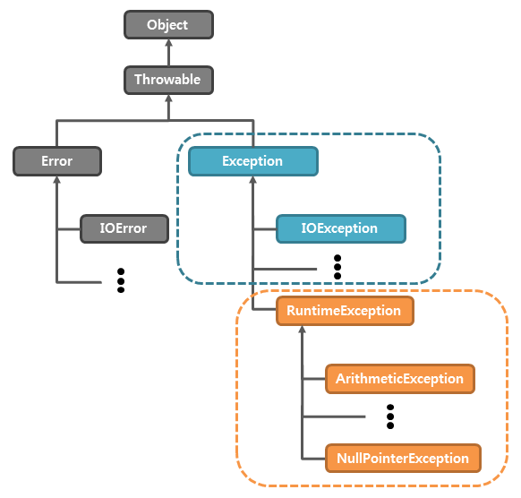

# [백기선의 live Study - 9주차](https://github.com/whiteship/live-study/issues/9)

## 목표
자바의 예외 처리에 대해 학습하세요.

## 예외처리란?

프로그램 실행시 발생할 수 있는 예외에 대비하는 것으로 프로그램 비정상 종료를 막고 실행상태를 유지하는것.

## 자바에서 예외 처리 방법(try, catch, throw, throws, finally)

```java
try {
/** 
* 정상이라면 이 코드는 아무런 문제없이 블록의 시작부터 끝까지 실행된다. 
* 하지만 경우에 따라 예외가 발생할 수 있다. 
* 예외는 throw 문에 의해 직접적으로 발생할 수도 있고, 
* 또는 예외를 발생시키는 메서드의 호출에 의해 발생할 수도 있다. 
*/
} catch (예외 e1) {
/** 
* 이 블록 내부의 문장들은 오직 try 블록에서 예외가 발생할 경우에만 실행된다. 
* 이 문장들에선 지역 변수 e를 사용하여 Error 객체 또는 앞에서 던진 다른 값을 참조할 수 있다. 
* 이 블록에서는 어떻게든 그 예외를 처리할 수도 있고, 
* 그냥 아무것도 하지 않고 예외를 무시할 수도 있고, 
* 아니면 throw 를 사용해서 예외를 다시 발생시킬 수도 있다. 
*/
} catch (예외 e2) {
/** 
* 여러 종류의 예외를 여러개의 catch를 통해 다르게 처리가 가능하다.
* 하지만 catch순서대로 Exception을 처리하기 때문에 앞의 예외타입이 뒤의 예외타입의 레벨(depth)보다 낮아야한다.
*/
} finally {
/** 
* 이 블록에는 try 블록에서 일어난 일에 관계없이 무조건 실행될 코드가 위치한다. 
* 이 코드는 try 블록이 어떻게든 종료되면 실행된다. 
* try 블록이 종료되는 상황은 다음과 같다. 
* 1) 정상적으로 블록의 끝에 도달했을 때 
* 2) break, continue 또는 return 문에 의해서 
* 3) 예외가 발생했지만 catch 절에서 처리했을 때 
* 4) 예외가 발생했고 그것이 잡히지 않은 채 퍼져나갈 때 
*/
}
```

## 자바가 제공하는 예외 계층 구조


1. 최상위는 `Object` 클래스이다.
2. `에러클래스`와 `예외클래스`는 `Throwable 클래스` 에서 상속받는다.

## Exception과 Error의 차이는?

#### Exception

- 사용자의 잘못된 조작 또는 개발자의 잘못된 개발방식으로 발생된 프로그램 오류
- 예외처리를 통해 종료하지 않고 정상 실행 상태를 유지할 수 있다.
- (예) `NPE`, `divided 0` 등


#### Error

- 시스템에 비정상적인 상황이 생겼을때 발생
- 심각한 수준의 오류이며, 프로그래머가 미리 예측하여 처리할 수 없어 오류 처리를 신경쓰지 않아도 된다.
- (예) `연동된 DB 연결 불가` 등

### Checked Exception & Unchecked Exception

Checked Exception | Unchecked Exception
---------|----------
예외처리는 필수 | 예외처리는 선택
컴파일 단계에서 확인 가능 | 런타임 단계에서 확인 가능
IOException, SQLException 등 | NullPointerException, IndexOutOfBoundException 등

## runtimeException과 RE가 아닌 것의 차이는?

1. 컴파일 에러  
   -> 컴파일언어인 자바는 프로그램 시작전 세미콜론이 빠졌다던지 문법에 맞지 않는 코드를 작성하였을때 오류를 띄워준다.
2. 런타임 에러  
   -> 프로그램 실행 후 나타나는 에러로 크게 `NPE`, `divided 0` 등의 에러가 있다.
3. 논리적 에러  
   -> 프로그램은 제대로 실행되었으나 원하는 기대값이 나오지 않는 경우에 대한 에러. 

## 커스텀한 예외 만드는 방법

Exception을 상속받아 커스텀한 예외를 만들 수 있다.

```java
class CustomException extends Exception {
   public MyException() {
      super();
   }

   public MyException(String message) {
      super(message);
   }
}

public class Example {
   public static void main(String[] args) {
      try {
         throw new MyException("커스텀 익셉션 발생");
      } catch (MyException e) {
         e.printStackTrace();
      }
   }
}
```

---

### 출처
