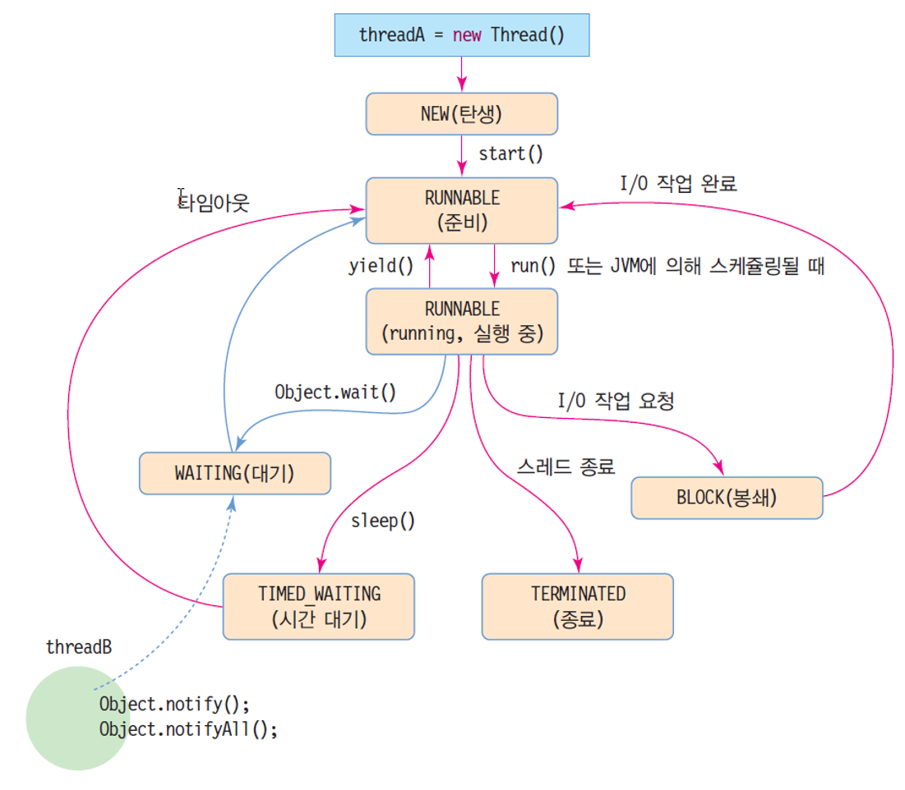
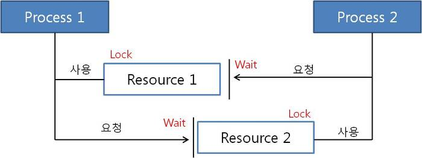

# [백기선의 live Study - 10주차](https://github.com/whiteship/live-study/issues/10)

## 목표

자바의 멀티쓰레드 프로그래밍에 대해 학습하세요.

## 쓰레드란?

프로그램을 실행하면 OS로부터 실행에 필요한 자원을 할당받아 프로그램이 실행된다. 프로그램이 실행된 결과물은 바로 프로세스이다.

하나의 프로세스는 데이터(data) + 자원(memory) + 쓰레드(thread)로 구성되어 있어 모든 프로세스에는 최소한 하나 이상의 쓰레드가 존재하며, 두 개 이상의 쓰레드를 가지면 멀티 쓰레드라고 한다.

## Thread 클래스와 Runnable 인터페이스

자바에서는 쓰레드를 생성하는 방식이 2가지가 있는데, 하나는 `Thread`클래스를 상속받아서 사용하는 것이고, 나머지 하나는 `Runnable` 인터페이스를 구현하는 방식이다.

### Thread 클래스를 상속하여 구현

```java
// Thread 클래스를 상속받아 사용자 정의 Thread를 생성
class Pizza extends Thread {

   @Override
   public void run() {
      super.run();
      System.out.println("피자를 만듭니다.");
   }
}

public class Cook {

   public static void main(String[] args) {
      Pizza pizza = new Pizza();
      // start 메서드를 호출하면 쓰레드 객체의 run 메서드를 호출한다.
      Pizza.start();
   }
}
```

### Runnable 인터페이스를 상속하여 구현

```java
// Runnable 인터페이스를 상속받아 구현
class Pizza implements Runnable {

   @Override
   public void run() {
      System.out.println("피자를 만듭니다.");
   }
}

public class Cook {

   public static void main(String[] args) {
      // Runnable 인터페이스를 구현하여 Thread를 만들 경우 객체 생성시 Thread 클래스 타입으로 만들어 주어야 한다.
      // (run() 메서드를 실행시키는 start() 메서드가 Thread 클래스에 정의되어 있기 떄문)
      Thread pizza = new Thread(new Pizza());
      pizza.start();
   }
}
```

### (옵션) 람다를 이용한 Thread 실행

```java
public class Cook {

   public static void main(String[] args) {
      Thread pizza = new Thread(() -> {
         String threadName = Thread.currentThread().getName();
         System.out.println(threadName + "을(를) 만듭니다.");
      });

      pizza.setName("피자");
      pizza.start();
   }
}
```

**일반적인 방법은 `Runnable` 인터페이스를 구현하여 사용하는 것**이라고 한다. **다중 상속이 불가능한 자바의 특성상 해당 방식이 조금 더 유연성이 있어서 그런것이 아닐까** 생각된다.

## 쓰레드의 상태

`스레드의 생명주기` 라고도 말할 수 있다.




상태 | 설명 
---------|----------
 NEW | 스레드가 생성되었지만 아직 실행되지 않음.
 RUNNABLE | 스레드가 JVM에 의해 실행되고 있거나, 실행 준비 되어 스케쥴링 대기중.
 WAITING | 다른 스레드가 `notify()`, `notifyAll()`을 호출하는 것을 대기중. **보통 스레드 동기화를 위해 사용한다.**
 TIMED_WAITING | 스레드가 `sleep()`을 호출하여 일시중지된 상태.
 BLOCK | 스레드가 I/O작업 요청을 하면 자동으로 변경되는 상태.
 TERMINATED | 스레드 종료.

### 스레드 상태와 관련된 메서드

메서드 | 설명 
---------|----------
sleep() | 주어진 시간동안 일시정지 상태가 되었다가 다시 실행대기상태로 돌아간다.
join() | 특정 쓰레드가 다른 쓰레드의 완료를 기다리게 한다.
interrupt() | `sleep()`, `join()`에 의해 일시정지상태 쓰레드를 실행대기 상태로 만든다.
stop() | 쓰레드를 즉시 종료시킨다.
suspend() | 쓰레드를 일시정지 시킨다.
resume() | `suspend()`로 일시정지 되었던 쓰레드를 실행대기상태로 만든다.
yield() | 실행중에 다른 쓰레드에게 양보하여 실행대기상태가 된다.

> `resume()`, `stop()` `suspend()`는 Thread를 교착상태로 만들기 쉽기때문에 자바에서 deprecated시켰다고 한다.

## 쓰레드의 우선순위

멀티 스레드는 `동시성(concurrency)` 또는 `병렬성(Parallelism)`으로 실행된다.

동시성은 하나의 코어에서 멀티 스레드가 번갈아가며 실행하는 성질을 말하며, 병렬성은 멀티 작업을 통해 멀티 코어에서 개별 스레드를 동시에 실행하는 성질을 말한다.

자바의 스레드 스케쥴링은 `우선순위(Priority)`방식과 `순환 할당(Round-Robin)` 방식을 사용한다.

- **우선순위:** Priority 값이 더 높은 스레드가 실행 상태를 더 많이 가지게 된다. 우선순위는 1~10까지 설정가능하며, 기본적으로는 5를 할당받게 된다. 기본적으로 3개의 상수를 제공한다. 사용자가 우선순위 컨트롤 가능.
- **라운드 로빈:** 시간 할당량(Time Slice)를 정하여, 하나의 스레드를 정해진 시간만큼 실행시키고 다시 다른 스레드를 실행한다. JVM이 컨트롤.

```java
/**
 * The minimum priority that a thread can have.
 */
public final static int MIN_PRIORITY = 1;

/**
 * The default priority that is assigned to a thread.
 */
public final static int NORM_PRIORITY = 5;

/**
 * The maximum priority that a thread can have.
 */
public final static int MAX_PRIORITY = 10;
```

### 쓰레드 우선순위 설정 예시

```java
public class Cook {

   public static void main(String[] args) {
      Thread pizza = new Thread(() -> System.out.println("피자를 만듭니다."));
      Thread chicken = new Thread(() -> System.out.println("치킨을 만듭니다."));

      // 현재 우선순위
      System.out.println("피자의 우선순위 :" + pizza.getPriority()); // 5
      System.out.println("치킨의 우선순위 :" + chicken.getPriority()); // 5

      // 우선순위 설정
      pizza.setPriority(Thread.MIN_PRIORITY);
      chicken.setPriority(Thread.MAX_PRIORITY);

      System.out.println("피자의 우선순위 :" + pizza.getPriority()); // 1
      System.out.println("치킨의 우선순위 :" + chicken.getPriority()); // 10

      pizza.start();
      chicken.start();
   }
}
```

## Main 쓰레드

메인 메서드를 통해 프로그램을 실행하면 하나의 쓰레드가 시작되는데 그것을 메인 쓰레드라고 부른다.

꾸준히 사용해오던 `public static void main(String[] args)`가 그것이다.

- `currentThread()`: 해당 쓰레드의 참조값을 가져올 수 있다.
- `getName()`: `currentThread()`로 가져온 쓰레드의 Name값을 가져올 수 있다.

```java
public class MainThread {
   
   public static void main(String[] args) {
      Thread thread = Thread.currentThread();
      System.out.println(thread.getName());
   }
}
```

## 동기화

쓰레드가 사용중인 객체를 다른 쓰레드가 변경할 수 없도록 하려면 쓰레드 작업이 끝날 때까지 객체에 잠금을 걸어 다른 쓰레드가 사용할 수 없도록 한다.

멀티쓰레드 프로그램에서 단 하나의 쓰레드만 실행할 수 있는 코드 영역을 임계영역(Critical Section) 이라고 하며, 자바는 임계영역을 지정하기 위해 동기화 메서드와 동기화 블록을 제공한다.

`synchronized`키워드를 붙여 동기화 메서드를 만든다. 인스턴스와 정적 메서드 어디든 붙일 수 있다.

- 특정한 객체에 lock을 걸 때

```java
synchronized (객체의 참조변수) {
   // 참조변수로 들어온 객체는 synchronized 블록에 들어오면 lock에 잠기고, 블록이 종료가 되면 lock이 해제된다.
  // 잠긴 사이에는 다른 쓰레드가 접근할 수 없다.
}
```

- 메서드에 lock을 걸 때

```java
public synchronized void example() {
  // 한 쓰레드가 synchronized 메소드를 호출해서 수행하고 있으면, 
  // 이 메소드가 종료될 때 까지 다른 쓰레드는 이 메소드를 호출할 수 없다.
}
```

- 동기화 예제

```java
public class Cook {

   public static void main(String[] args) {
      try {
         Pizza pizza = new Pizza(10);
         new Thread(pizza, "콤비네이션").start();
         new Thread(pizza, "불고기").start();
         new Thread(pizza, "하와이안").start();
      } catch (Exception e) {
         e.printStackTrace();
      }
   }
}

class Pizza implements Runnable {
   private int requestQuantity;
   private int finishQuantity;
   private int canCookCount = 3;

   public Pizza(int requestQuantity) {
      this.requestQuantity = requestQuantity;
   }

   @Override
   public void run() {
      while (requestQuantity < finishQuantity) {

         synchronized(this) {
            finishQuantity++;
            System.out.println("현재 만들어야하는 피자의 개수 : " + requestQuantity - finishQuantity);
         }

         for (int i = 0; i < canCookCount; i++) {
            if(canCookCount == 0) {
               continue;
            }

            synchronized(this) {
               canCookCount--;
               System.out.println(Thread.currentThread().getName() + "피자을(를) 만드는 중입니다.");
            }

            try {
               // 피자를 만드는데 3초가 걸린다고 가정.
               Thread.sleep(3000);
            } catch (Exception e) {
               e.printStackTrace();
            }

            synchronized(this) {
               System.out.println(Thread.currentThread().getName() + "피자을(를) 만들었습니다.");
               System.out.println("-------------------------------------------------------");
               canCookCount++;
            }

            break;
         }
      }
   }
}
```

- 결과물
```
현재 만들어야 하는 피자의 개수 : 9
콤비네이션피자을(를) 만드는 중 입니다.
현재 만들어야 하는 피자의 개수 : 8
불고기피자을(를) 만드는 중 입니다.
현재 만들어야 하는 피자의 개수 : 7
하와이안피자을(를) 만드는 중 입니다.
콤비네이션피자을(를) 만들었습니다.
-------------------------------------------------------
불고기피자을(를) 만들었습니다.
-------------------------------------------------------
하와이안피자을(를) 만들었습니다.
-------------------------------------------------------
현재 만들어야 하는 피자의 개수 : 6
콤비네이션피자을(를) 만드는 중 입니다.
현재 만들어야 하는 피자의 개수 : 5
불고기피자을(를) 만드는 중 입니다.
현재 만들어야 하는 피자의 개수 : 4
하와이안피자을(를) 만드는 중 입니다.
콤비네이션피자을(를) 만들었습니다.
-------------------------------------------------------
불고기피자을(를) 만들었습니다.
-------------------------------------------------------
현재 만들어야 하는 피자의 개수 : 3
불고기피자을(를) 만드는 중 입니다.
하와이안피자을(를) 만들었습니다.
-------------------------------------------------------
현재 만들어야 하는 피자의 개수 : 2
콤비네이션피자을(를) 만드는 중 입니다.
현재 만들어야 하는 피자의 개수 : 1
하와이안피자을(를) 만드는 중 입니다.
콤비네이션피자을(를) 만들었습니다.
-------------------------------------------------------
불고기피자을(를) 만들었습니다.
-------------------------------------------------------
하와이안피자을(를) 만들었습니다.
-------------------------------------------------------
현재 만들어야 하는 피자의 개수 : 0
콤비네이션피자을(를) 만드는 중 입니다.
-------------------------------------------------------

Process finished with exit code 0
```

## 데드락



`교착상태`라고도 불리며, 한정된 자원을 여러 쓰레드가 사용할 경우 발생할 수 있다.

상단의 그림처럼 `프로세스1`이 `리소스1`을 사용하고 `리소스2`에 대한 사용 권한을 요청하였으나 그와 거의 동시에 `리소스2`를 사용하고 있는 `프로세스2`가 `리소스1`에 대한 사용권한을 요청한다면 서로의 자원을 반납하지 못하고 무한 루트가 돌게된다.

### 데드락의 발생 조건

- 한 시스템 내에서 다음의 네가지 조건이 동시에 성립할 때 발생하며, 네 가지 조건 중 하나라도 성립하지 않도록 만들면 교착 상태를 해결 가능하다.

조건 | 설명
---------|----------
상호 배제 (Mutual exclusion) | 자원은 한 번에 한 프로세스만이 사용할 수 있어야 한다.
점유 대기 (Hold and wait) | 최소한 하나의 자원을 점유하고 있으면서 다른 프로세스에 할당되어 사용하고 있는 자원을 추가로 점유하기 위해 대기하는 프로세스가 있어야 한다.
비선점 (No preemption) | 다른 프로세스에 할당된 자원은 사용이 끝날 때까지 강제로 빼앗을 수 없어야 한다.
순환 대기 (Circular wait) | 프로세스의 집합 {P0, P1, ,…Pn}에서 P0는 P1이 점유한 자원을 대기하고 P1은 P2가 점유한 자원을 대기하고 P2…Pn-1은 Pn이 점유한 자원을 대기하며 Pn은 P0가 점유한 자원을 요구해야 한다.

### 자바코드 예제

위는 운영체제에 기반한 개념이며 자바로 알아보자.

```java
// 데드락 위험이 있는 코드
public class LeftRightDeadlock {
  private final Object left = new Object();
  private final Object right = new Object();
  public void leftRight() {
    synchronized (left) {
      synchronized (right) {
        doSomething();
      }
    }
  }
  public void rightLeft() {
    synchronized (right) {
      synchronized (left) {
        doSomethingElse();
      }
    }
  }
}
```

1. 스레드 A가 락 left을 확보한 상태에서 락 right을 확보하려 대기
2. 스레드 B가 락 right을 확보한 상태에서 락 left을 확보하려고 대기
3. 양쪽 스레드 A, B는 서로가 락을 풀기를 영원히 기다리게 됨

> 위와 같이 Java Thread에서도 스레드 하나가 특정 락(Lock)을 놓지 않고 계속 잡고 있으면 그 락을 확보하려는 다른 스레드는 락이 풀릴 때까지 기다리는 수 밖에 없다. Deadlock은 Thread가 두 개의 락을 획득하려 하는 코드에서 나타난다. 학교에서 배울 때는 이 정도 수준에서 멈추는 경우가 많은데 데드락은 상용 서비스를 시작하고 나서 시스템에 부하가 걸리는 경우와 같이 최악의 상황에서 그 모습을 드러내곤 한다. 더군다나 아주 심도있는 방법으로 부하 테스트(load-testing)을 진행했다 하더라도 발생 가능한 데드락 모두 찾아낼 수는 없다. JVM에서는 데이터베이스 서버와 같이 데드락 상태 추적 기능이 없기 때문에 Java Application에서 데드락이 발생했을 때 정상으로 되돌리려 한다면 애플리케이션을 종료하고 다시 실행하는 것밖에 없다. (출처 : https://icednut.space/2016/08/06/20160806-about_deadlock)

### 데드락 예방하기

1. Lock이 발생하는 순서를 정해놓는다.

> 프로그램 내부의 모든 스레드에서 필요한 락을 모두 같은 순서로만 사용한다면, 락 순서에 의한 데드락은 발생하지 않는다. (자바 병렬 프로그래밍 P.307)

- 해결 전: 데드락 위험이 있는 코드

```java
// 파라미터 fromAccount와 toAccount에 순서만 달리해서 동시 호출이 일어난다면 데드락 확률이 증가한다.
public void transferMoney (Account fromAccount, Account toAccount, DollarAmount amount) {
  synchronized (fromAccount) {
    synchronized (toAccount) {
      if (fromAccount.getBalance().compareTo(amount) < 0) {
        throw new InsufficientFundsException();
      } else {
        fromAccount.debit(amount);
        toAccount.credit(amount);
      }
    }
  }
}
```

- 해결 후: Lock이 발생하는 순서를 제어한 경우

```java
private static final Object tieLock = new Object();

public void transferMoney(final Account fromAccount, final Account toAccount, final DollarAmount amount) {

  class Helper {
    public void transfer() {
      if (fromAccount.getBalance().compareTo(acmount) < 0) {
        throw new InsufficientFuncsException();
      } else {
        fromAccount.debit(amount);
        toAccount.credit(ammount);
      }
    }

  }

  int fromHash = System.identityHashCode(fromAccount);
  int toHash = System.identityHashCode(toAccount);

  if (fromHash < toHash) {
    synchronized(fromAccount) {
      synchronized(toAccount) {
        new Helper().transfer();
      }
    }
  } else if (fromHash > toHash) {
    synchronized(toAccount) {
      synchronized(fromAccount) {
        new Helper().transfer();
      }
    }
  } else {
    synchronized (tieLock) {
      synchronized(fromAccount) {
        synchronized(toAccount) {
          new Helper().transfer();
        }
      }
    }
  }
}
```

2. 오픈 호출

메소드 호출이라는 것은 그 너머에 어떤 일이 일어나는지 모르게 막아주는 추상화 방법이다. 하지만 호출한 메소드 내부에서 어떤 일이 일어나는지 알지 못하기 때문에 특정 락을 확보한 상태에서 다른 메소드를 호출한다는 것은 파급 효과를 분석하기가 어렵고 위험한 일이다. 이에 따라 락을 전혀 확보하지 않은 상태에서 메소드를 호출하는 것이 좋은데 이것을 오픈 호출이라고 한다. (스레드 안정성을 확보하기 위해 캡슐화 기법encapsulation을 사용하는 것과 비슷)

락을 확보하지 않은 상태에서 메소드를 호출하는게 관건이라고 한다.

3. 락의 시간 제한

암묵적인 락 synchronized 말고 락 시간을 제한할 있는 Lock 클래스의 tryLock 메소드를 사용한다. 암묵적인 락은 락을 확보할 때까지 영원히 기다리지만, Lock 클래스 등의 명시적인 락은 일정 시간을 정해두고 그 시간 동안 락을 확보하지 못한다면 tryLock 메소드가 오류를 발생시키도록 할 수 있다.

---

### 출처

[[JAVA] 스레드(Thread)와 멀티태스킹](https://velog.io/@ruthetum/JAVA-Thread-Multitasking)

[[Java] 스레드 이름, 우선순위(priority), 동기화(synchronized) 실습하면서 알아보기](https://deftkang.tistory.com/56)

[Java - Thread 우선순위(Priority)를 설정하는 방법](https://codechacha.com/ko/java-thread-priority/)

[[운영체제] 데드락, 교착상태 해결 (Dead lock)](https://includestdio.tistory.com/12)

[Deadlock이 뭐지? (Java Thread와 Deadlock에 대한 고찰)](https://icednut.space/2016/08/06/20160806-about_deadlock)