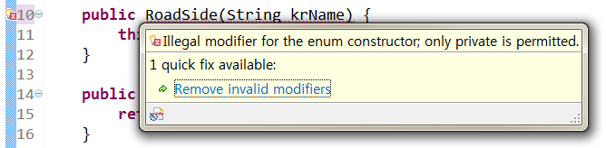

# [백기선의 live Study - 11주차](https://github.com/whiteship/live-study/issues/11)

## 목표
자바의 열거형에 대해 학습하세요.

### enum이란?

관련이 있는 상수들의 집합이다.

기존 `Enum`을 사용하기 전, 자바에서는 `final`로 String과 같은 문자열이나 숫자들을 나타내는 기본 자료형의 값을 고정하여 상수로 사용했다.

### enum이 나오기 전

1. `final` 사용
```java
public class Week {
  private final static int MONDAY = 1;
  private final static int TUESDAY = 2;
  private final static int WEDNESDAY = 3;
  ...
  private final static int SATURDAY = 6;
  private final static int SUNDAY = 7;
}
```
- `final`을 통해 변경되지 않도록 하면서 `static`을 사용하여 메모리에 한번만 할당되도록 설정.
- **(단점)**한눈에 알아볼 수 있지만, 추가 데이터를 넣을 경우(month에 대한 데이터 등) 상수가 많아지며 관리하기가 힘들어짐.

2. `interface` 사용
```java
interface DAY {
  int MONDAY = 1;
  int TUESDAY = 2;
  int WEDNESDAY = 3;
  ...
  int SATURDAY = 6;
  int SUNDAY = 7;
}

interface MONTH {
  int JANUARY = 1;
  int FEBRUARY = 2;
  int MARCH = 3;
  ...
  int NOVEMBER = 11;
  int DECEMBER = 12;
}

public class EnumExample {
  public static void main(String[] args) {
    if(DAY.MONDAY == MONTH.JANUARY) {
      System.out.println("두 상수는 같다.");
    }
  }
}
```
- 깔끔하게 두개의 특징을 갖는 상수 집합 작성하였으며, 각 집합에서 이름이 같은 상수도 정의 할 수 있다.
- `interface`로 선언된 변수는 `public static final` 속성을 생략할 수 있다.
- **(단점)** 서로 다른 집합에 정의된 상수들은 서로 비교할 수 없어야하는데, 비교가 가능하게 되어있다. 해당건으로 컴파일단계에서 에러를 확인할 수 없어 런타임 단계에서 예기치 못한 문제를 발생시킬 수 있다.

3. `class` 사용
```java
class Day {
  public final static Day MONDAY = new Day();
  public final static Day TUESDAY = new Day();
  public final static Day WEDNESDAY = new Day();
  ...
}

class Month {
  public final static Month JANUARY = new Month();
  public final static Month FEBRUARY = new Month();
  public final static Month MARCH = new Month();
  ...
}

public class EnumExample {
  public static void main(String[] args) {
    if(Day.MONDAY == Month.JANUARY) { //에러
      System.out.println("두 상수는 같다.");
    }

    switch (day) {
      case DAY.MONDAY:
        System.out.println("월요일");
        break;
      ...
    }
  }
}
```
- 각각의 상수들의 타입을 자신의 상수집합의 이름으로 지정하여 자기 자신을 인스턴스화 한 값을 할당한다. 때문에 다른 데이터 타입은 비교할 수 없기때문에 두개의 상수를 비교하는 구문에서 컴파일 에러가 발생한다.
- **(단점)** `switch문` 사용이 불가하다. `switch문`의 조건에 들어가는 데이터 타입은 제한적이라 class가 사용되지 못한다.

### enum 정의하는 방법

```java
enum Day {
  MONDAY, TUESDAY, WEDNESDAY, THURSDAY, FRIDAY, SATURDAY, SUNDAY;
}

enum Month {
  JANUARY, FEBRUARY, MARCH, APRIL, MAY, JUNE, JULY,
  AUGUST, SEPTEMBER, OCTOBER, NOVEMBER, DECEMBER;
}

public class EnumExample {
  public static void main(String[] args) {
    Day day = Day.MONDAY;

    switch(day) {
      case MONDAY:
        System.out.println("월요일");
        break;
      ...
    }
  }
}
```
- 코드가 단순해지며 가독성이 좋다.
- 인스턴스 생성과 상속을 방지한다.
- 키워드 enum을 사용하기 때문에 구현의 의도가 열거임을 분명하게 나타낼 수 있다.
- (`enum` 방식으로 구현한 방식과 `class`방식으로 구현한 방식은 내부적으로는 동일하다.)

### enum이 제공하는 메소드 (values()와 valueOf())

- **`values()`**
  - `enum`안에 존재하는 모든 값들을 반환한다.
  ```java
    Day arr[] = Day.values(); // 결과 : [MONDAY, TUESDAY, ... SATURDAY, SUNDAY]
  ```

- **`ordinal()`**
  ```java
    // ordinal 사용
    System.out.println(Day.TUESDAY.ordinal()); // 1
  ```
  - `enum`안에 정의된 순서대로 각 enum 상수 인덱스를 반환한다.
  - **절.대.사.용.금.지.해.**
    - 상수 선언 순서를 바꾸는 순간 원하지 않은 값을 반환한다.
    - 이미 사용중인 상수와 값이 같은 상수는 추가할 수 없다.
    - 값을 중간에 비울 수 없다.
    - 필요하다면 `인스턴스 필드에 저장할것`.

  ```java
  // 인스턴스 필드에 저장할 경우.

  public enum Day {
    private final String korName;

    MONDAY("월요일"), TUESDAY("화요일"), ... SATURDAY("토요일"), SUNDAY("일요일");

    Day(String korName) {
      this.korName = korName;
    }

    public String getKorName() {
      return korName;
    }
  }

  // 임의 출력
  System.out.println(Day.TUESDAY.getKorName()); // 화요일
  ```
  - 생성자를 통해 필드에 값을 설정하고 getter를 통해 해당 속성을 가져올수 있다.

- **`valueOf()`**
  - 특정 `enum`의 상수 값을 문자열을 통해 얻을 수 있다.
  ```java
    System.out.println(Day.valueOf("SATURDAY")); // Day.SATURDAY와 동일.
  ```

- **`name()`**
  - 열거 객체가 가지고 있는 문자열을 리턴한다. 이때 리턴되는 문자열은 열거타입을 정의할때 사용한 상수 이름과 동일하다.
  ```java
    System.out.println(Day.SUNDAY.name()) // SUNDAY
  ```

- **`compareTo()`**
  - 매개값으로 주어진 열거 객체를 기준으로 전후 몇번째 위치하는지 비교한다.
  - 만약 열거객체가 매개값의 열거객체보다 순번이 빠르다면 음수, 순번이 늦다면 양수가 리턴된다.
  ```java
    System.out.println(Day.THURSDAY.compareTo(Day.MONDAY)); // 3
    System.out.println(Day.THURSDAY.compareTo(Day.SUNDAY)); // -3
  ```

### java.lang.Enum

- 모든 `enum`들은 내부적으로 `java.lang.enum` 클래스에 의해 상속된다. 자바는 다중상속을 지원하지 않기 때문에 `enum`은 다른 클래스를 상속받을 수 없다.

#### enum 생성자가 private 인 이유(묵시적)

Java에서 enum타입은 열거형을 의미하는 특별한 형태의 클래스라 일반 클래스와 같이 생성자가 필요하다.  
대신 `enum`에서는 생성자를 `private`로 만들어주어야 하는데, `public`이나 `protected`로 할 경우 해당 에러가 발생한다.



`enum` 타입은 고정된 상수들의 집합으로, 런타임이 아닌 컴파일타임에 모든 값을 알고 있어야 한다. 즉 **다른 패키지나 클래스에서 `enum` 타입의 값을 변경할 수 없으며 컴파일시 타입 안정성이 보장된다. **(해당 enum 클래스는 `new`로 인스턴스 생성이 불가하며 `newInstance()`, `clone()` 등의 메서드도 사용이 불가하다.)  

이때문에 생성자의 접근제어자를 `private`로 설정해야 하며, 외부에서 접근가능한 생성자가 없으므로 실제 `final`과 다름 없다.

결국 enum타입은 인스턴스 생성을 제어하며 `싱글톤`으로 처리된다.

### EnumSet

`enum` 유형에 사용하기 위한 특수 `Set` 구현체로 `AbstractSet` 클래스를 상속하고 `Set` 인터페이스를 구현한 형태이다.

- 열거형 타입으로 지정해놓은 요소들을 가장 쉽고 빠르게 다룰 수 있다.
- 요소의 개수가 2^6^을 넘지 않을 경우 Long 데이터형의 비트 필드를 사용
- `Set`을 기반으로 하는것 처럼 보이지만, 내부적으로 비트필드를 사용하기 떄문에, 메모리 공간을 적게 차지하고 속도도 빠르다.
- `enum`과 `static` 메서드로 구성되어 있어 안정성을 추구하면서 편리한 사용이 가능.

```java
public class EnumSetExample {
  enum Day {
    MONDAY, TUESDAY, WEDNESDAY, THURSDAY, FRIDAY, SATURDAY, SUNDAY;
  }

  public static void main(String[] args) {
    // 1. allOf() : Day의 모든 요소를 반환
    EnumSet es = EnumSet.allOff(Day.class);
    EnumSet esTest = EnumSet.copyOf(es);
    System.out.println("allOf: " + es); // [MONDAY, TUESDAY, WEDNESDAY... SATURDAY, SUNDAY]

    // 2. noneOf() : 열거형 Day 내용 비우기
    es = EnumSet.noneOf(Day.class);
    System.out.println("noneOf: " + es); // []

    // 3. of() : 지정한 요소를 반환
    es = Enum.set.of(DAY.WEDNESDAY, DAY.FRIDAY);
    System.out.println("of: " + es); // [WEDNESDAY, FRIDAY]

    // 4. comeplement
    esTest = Enum.set.of(DAY.WEDNESDAY, DAY.FRIDAY);
    es = EnumSet.complementOf(esTest); 
    System.out.println("complementOf: " + es); // [MONDAY, TUESDAY, THURSDAY, SATURDAY, SUNDAY]

    // 5. range() : 지정된 구간 내의 요소만 반환
    es = EnumSet.range(Day.TUESDAY, Day.FRIDAY);
    System.out.println("range: " + es); // [TUESDAY, WEDNESDAY, THURSDAY, FRIDAY]
  }
}
```

---

### 출처

