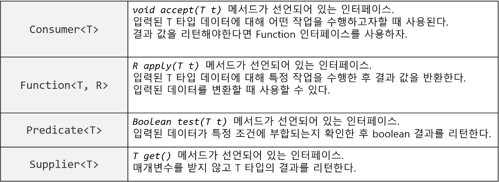

# [백기선의 live Study - 15주차](https://github.com/whiteship/live-study/issues/15)

## 목표

자바의 람다식에 대해 학습하세요.

### 람다함수란?

람다 함수는 프로그래밍 언어에서 사용되며 **익명함수**를 지칭하는 용어이다. 수학에서 사용하는 함수를 보다 단순하게 표현하는 방법이다.

### 익명함수란?

익명함수란 함수의 이름이 없는 함수이며, 공통으로 **일급객체(First Class citizen)**라는 특징을 가지고 있다.  
일급객체란 일반적으로 다른 객체들에 적용 가능한 연산을 모두 지원하는 개체를 가르킨다. 함수를 값으로 사용할 수 있으며, 파라미터로 전달 및 변수에 대입 등의 연산들이 가능하다.

### 람다식 장&단점

#### 장점

1. 코드가 간결해진다.  
  - 불필요한 반복문의 삭제가 가능하여 복잡한 식을 단순하게 표현 가능하다.
2. 지연연산 수행이 가능하다.  
  - 지연연산을 수행하여 불필요한 연산이 최소화된다.
3. 병렬처리 가능하다.
  - 멀티쓰레드를 활용하여 병렬처리가 가능하다.

#### 단점

1. 호출이 까다롭다.
2. `stream`사용시 단순 반복문에 비해 성능이 떨어진다.
3. 불필요한 사용으로 오히려 가독성이 떨어지기도 한다.

### 람다식 사용법

```java
//1
(매개변수) -> {함수 몸체}
//2
매개변수 -> {함수 몸체}
//3
() -> {함수 몸체}
//4
(매개변수) -> 함수 몸체
```

1. 람다는 화살표(->)를 사용하여 간단하게 표현이 가능하다.
2. 매개변수가 하나만 있을 경우, 괄호(`()`)는 생략 가능하다.
3. 매개변수가 하나도 없을 경우, 괄호(`()`)는 생략이 불가능하다.
4. 함수 몸체가 단일 실행문으로 구성되어있는 경우 괄호(`{}`)를 생략할 수 있다.
  4-1. 괄호(`{}`)를 생략하였을 경우, 해당 실행문의 결과값이 return 된다.


### 함수형 인터페이스

- 추상 메서드가 하나만 있는 인터페이스
- `@FunctionalInterface`어노테이션을 지원한다.
- 해당 메서드가 `일급객체`이고, `순수함수`여야 한다.

#### 순수함수란?

**같은 입력값을 넣으면 같은 결과값이 나오는 것을 보장하는 함수**이다.
아래 조건을 만족한다.

- 함수 외부에 정의된 값을 변경하지 않는다.
- 함수 외부에 정의된 값을 참조하지 않는다.

#### 사용 예시

```java
@FunctionalInterface
public interface ArithmeticOperator {
  public int operate(int a, int b);
}
```

```java
@FunctionalInterface
public class ArithmeticCalculator {
  public static int calculate(int a, int b, ArithmeticOperator operator) {
    return operator.operate(a, b);
  }
}
```

```java
public class ArithmeticCalculatorTest {
  @Test
  pblic void test() {
    int num1 = 5;
    int num2 = 10;

    int result = ArithmeticCaculator.caculate(num1, num2, (a, b) -> a + b);
    Assert.assertEquals(num1 + num2, result);
  }
}
```

#### `java.util.function`패키지의 대표적인 인터페이스



---

### Variable Capture

- 람다 사용시 외부의 변수를 활용하는 것
  (**대신 외부에서 정의된 변수는 final이거나 final 속성을 띄어야한다.**)

```java
int baseValue = 1000;

Function<Integer, Integer> sum = input -> input + baseValue;
```

#### 왜?

람다 내부에서 접근가능한 변수는 아래와 같다.

1. 지역변수
2. static 변수
3. member 변수

이 중에서 지역변수만 변경이 불가한데 이부분은 **java의 메모리와 관련이 있다.**

나머지 변수와 다르게 `지역변수는 stack 영역에 저장`된다. 즉 어떤 thread가 함수를 호출하면 stack에 메모리를 잡고 지역변수와 기타 필요한 공간을 잡는다. 그리고 함수 사용이 완료되면 stack에서 해당 함수가 제거된다.

하지만 함수 내부에 람다식이 있고 해당 람다식이 다른 thread에서 수행되는 경우 곤란해진다. 람다식 외부에 정의된 지역변수는 해당 쓰레드가 종료되면서 사라지기때문에 람다 내부에서 수정이 불가능해진다. 따라서 **람다 내부에서는 해당 함수를 참조만 할 수 있도록 해당 값을 capturing하여 사용한다.**

#### 예제

```java
public void lambdaTest() {
    int base = 1000;

    new Thread( = () -> {
                try {
                    Thread.sleep(1000);
                    base = 999;            
               } catch(Exception e) {
                  /*  do nothing */
               } 
    }).start(); 
   	System.out.println(base);	
}
```

위 예제와 같이 새로운 thread를 만들고 lambda 내부에서 base에 값을 재할당 한다.
하지만 lambdaTest()란 함수는 람다를 실행하는 thread가 끝나기 전에 실행이 완료되에 stack 메모리에서 사라진다.
따라서 lambda내부에서 지역변수를 바꿀수가 없는상황이 생긴다.

참고로 멤버변수는 heap 메모리에 할당되기 때문에 thread가 공유가 가능하고, 따라서 람다에서도 읽고 쓰기가 가능하다. (Static 변수도 당연히 람다 내부에서 읽고 쓰기가 됨)

### 메소드, 생성자 레퍼런스

#### 메소드 레퍼런스

```java
// 포맷 - ClassName::Method

Person p) -> p.getAge()                     ==>    Person::getAge

() -> Thread.currentThread().dumpStack()  ==>   Thread.currentThread::dumpStack

(str, i) -> str.substring(i)                      ==>    String::substring

(String s) -> System.out.println(s)           ==>    System.out::println
```

기존 람다식을 더 줄일 수 있는 방식이다.

---

#### 생성자 레퍼런스

```java
Supplier<Person> constructor1 = Person::new;

Person p1 = constructor1.get();
```

클래스를 생성할떄 사용하는 생성자 역시 상위 메소드 레퍼런스처럼 사용가능하다.

### 출처

[Java 8 Lambda Expression - 람다식 #3](https://tourspace.tistory.com/6)