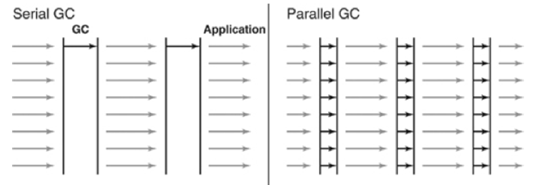
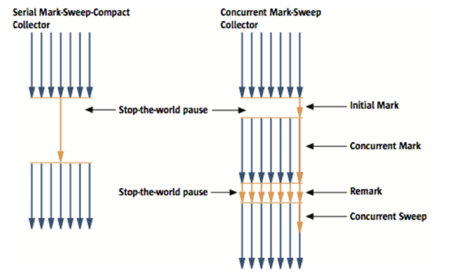
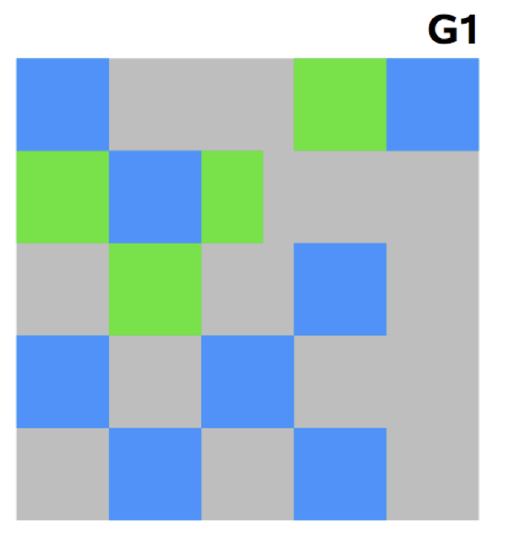

### Serial GC (-XX:+UseSerialGC)

Old 영역의 GC는 `mark-sweep-compact`라는 알고리즘 사용.

**`mark-seep-compact`** 알고리즘 단계

1. Old 영역에 살아 있는 객체를 식별(mark)
2. 힙(heap)의 앞 부분부터 확인하여 살아 있는 것만 남긴다(sweep)
3. 각 객체들이 연속되게 쌓이도록 힙의 가장 앞 부분부터 채워서 객체가 존재하는 부분과 객체가 없는 부분으로 나눈다.(Compaction)

**`Serial GC`는 적은 메모리와 CPU 코어 개수가 적을 떄 적합한 방식**

---

### Parallel GC (-XX:+UseParallelGC)

`Serial GC`와 기본적인 알고리즘은 같다.

허나 `Serial GC`는 GC를 처리하는 스레드가 하나인것에 비해, `Parallel GC`는 GC를 처리하는 쓰레드가 여러개이다. (병렬)
메모리가 충분하고 코어의 개수가 많을때 유리하며 `Serial GC`보다 빠르게 객체를 처리할 수 있다.
`Throughput GC`라고도 불린다.

**`Serial GC`와 `Parallel GC`의 스레드의 차이**

---

### Parallel Old GC(-XX:+UseParallelOldGC)

앞서 설명한 `Parallel GC`와 비교하여 Old 영역의 GC 알고리즘만 다르다.
이 방식은 `mark-summary-Compaction` 단계를 거친다.
Summary 단계는 앞서 GC를 수행한 영역에 대해서 별도로 살아 있는 객체를 식별한다는 점에서 `Mark-Sweep-Compaction`알고리즘의 Swepp 단계와 다르며, 약간 더 복잡한 단계를 거친다.

---

### CMS GC(-XX:UseConcMarkSweepGC)

**`Serial GC`와 `CMS GC`의 절차의 차이**

**`CMS GC` 단계**

1. `Inital Mark 단계`  
   클래스 로더에서 가장 가까운 객체중 살아있는 객체만 찾는것으로 끝낸다.  
   따라서 멈추는 시간은 매우 짧다.
2. `Concurrent Mark 단계`
   방금 살아있다고 확인한 객체에서 참조하고 있는 객체들을 따라가면서 확인한다.  
   (다른 스레드가 실행중인 상태에서 동시에 진행)
3. `Remark 단계`  
   쓰레기를 정리하는 작업을 실행  
   (다른 스레드가 실행중인 상태에서 동시에 진행)

이러한 단계로 진행되는 GC방식이라 `stop-the-world` 시간이 매우 짧아 응답 속도가 매우 중요할때 `CMS GC`를 사용하며, `Low Latency GC`라고도 부른다.

하지만 이러한 단점이 존재한다.

- 다른 GC방식보다 메모리와 CPU를 더 많이 사용한다.
- Compaction 단계가 기본적으로 제공되지 않는다.

신중히 검토한 후에 사용해야 하며, 조각난 메모리가 많아 Compaction 작업을 실행하면 다른 GC방식의 stop-the-world 시간보다 훨씬 더 길기때문에 Compaction 작업이 얼마나 자주, 오랫동안 수행되는지 확인해야 한다.

---

### G1 GC

`G1 GC`를 이해하려면 지금까지의 Young 영역과 Old 영역에 대해서는 잊는것이 좋다.
`G1 GC`는 바둑판의 각 영역에 객체를 할당하고 GC를 실행한다. 그러다가 해당 영역이 꽉 차면 다른 영역에서 객체를 할당하고 GC를 실행한다.  
**즉, 지금까지 설명한 Young의 세가지 영역에서 데이터가 Old영역으로 이동하는 단계가 사라진 GC 방식이라고 이해하면 된다.**

또한 장기적으로 말도 많고 탈도 많은 `CMS GC`를 대체하기 위해 만들어졌다.

**성능이 끝내준다. 지금까지 설명한 어떤 GC방식보다도 빠르다**

하지만 JDK6에서는 early access라고 부르며 시험삼아 사용할 수 있도록 하였고, JDK7에서 정식으로 제공한다.
