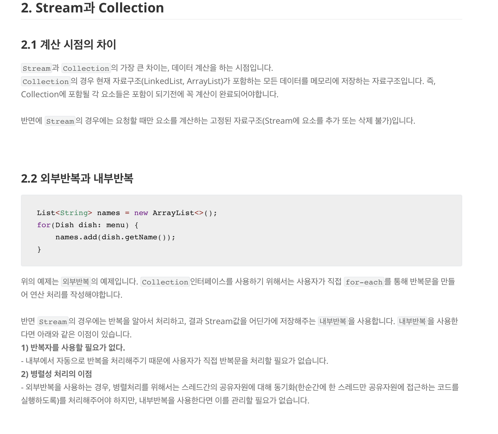

### 스트림과 컬렉션의 차이

- 스트림은 요소들을 보관하지 않은다. 요소들은 하부의 컬렉션에 보관되거나 필요할 때 생성된다.
- 스트림 연산은 원본을 변경하지 않고, 결과를 담은 새로운 스트림을 반환한다.
- 스트림 연산은 가능하면 lazy(지연) 처리된다. 지연 처리란 결과가 필요하기 전에는 실행하지 않음을 의미한다.  
  (예를 들어, 긴 단어를 모두 세는 대신 처음 5개 긴 단어를 요청하면, filter 메서드는 5번째 일치값을 찾은 후 필터링을 중단한다. 무한 스트림도 만들 수 있다.)

