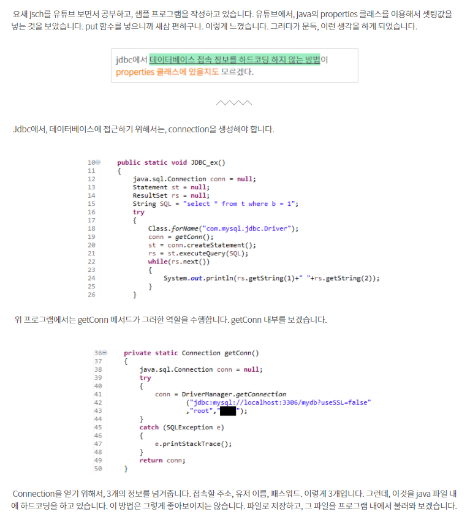
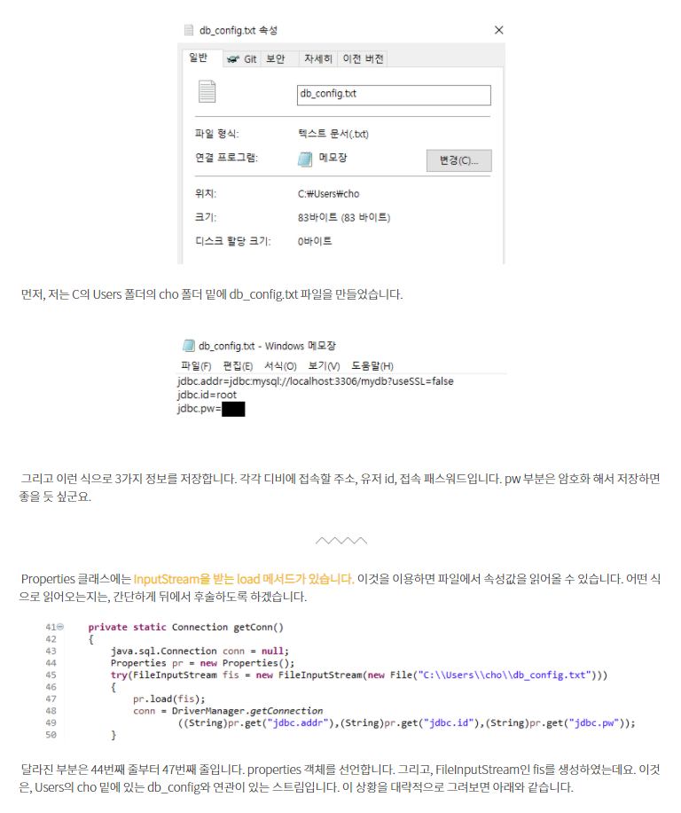
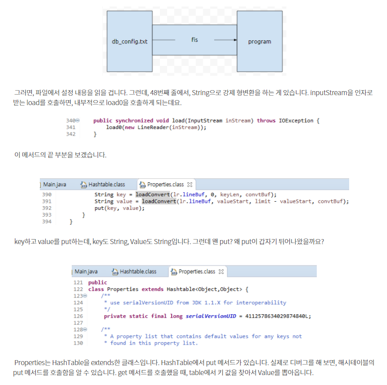
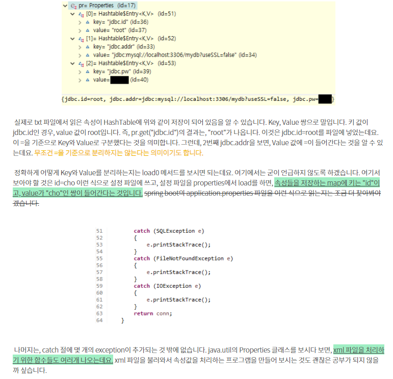

실제 웹 프로젝트를 진행하다 보면 스프링 내의 `properties` 를 사용하여 db 정보등을 가져오는 기능을 사용할 수 있다.

해당 세팅값을 어떻게 읽어오는 것일까?

[해당 글](https://codingdog.tistory.com/entry/java-properties-%ED%81%B4%EB%9E%98%EC%8A%A4-txt-%ED%8C%8C%EC%9D%BC%EB%A1%9C%EB%B6%80%ED%84%B0-%EC%86%8D%EC%84%B1%EA%B0%92%EB%93%A4%EC%9D%84-%EC%9D%BD%EC%96%B4%EB%B4%85%EC%8B%9C%EB%8B%A4?category=1055040)에서는 jdbc에서 데이터베이스 접속 정보를 하드코딩 하지 않는 방법을 properties에서 찾는다.

---

