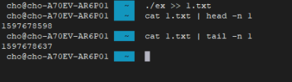
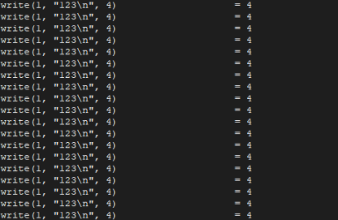
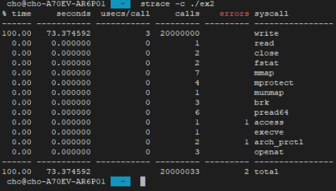
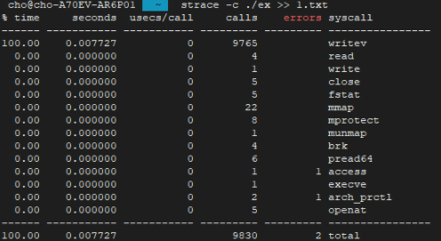
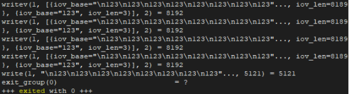
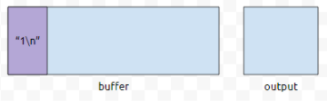
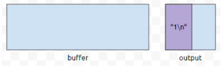

백준을 하면서 알게된 팁중에 `endl`을 쓰지 말자는 팁이 있었다.  
퍼포먼스가 떨어진다는 이유에서였는데, 정확히 알지 못했으나 [해당 글](https://codingdog.tistory.com/entry/%ED%95%AD%EC%83%81-flush%EB%A5%BC-%ED%95%B4%EC%84%9C-%EB%8A%90%EB%A6%B0-c-endl) 을 보고 정확히 알게되어 정리한다.

---

[공식 문서](http://www.cplusplus.com/reference/ostream/endl/)를 참고하여 만들어졌다.

`Insert a new line character, and flushes the stream`  
링크를 보면 위 문구가 눈에 보인다.

개행을 `stream`에 `insert` 한 다음에 `stream`을 `flush` 한다고 해석할 수 있다.

테스트를 위해 123이라는 문자열을 2000만번 출력하는 간단한 프로그램을 만들었다.  

```cpp
#include <iostream>
#include <time.h>
using namespace std;

int main(void) {
  cout << time(NULL) << endl;
  for (int i = 0; i < 20000000; i++) {
    cout << "123" << endl;
  }

  cout << time(NULL) << endl;
  return 0;
}
```



위 코드를 갖고있는 `ex`를 실행시켜 `1.txt`에 결과를 넣도록 하여 제일 위에 있는 값과 제일 아래 있는 값 (time(NULL) 출력 텍스트)를 뽑는다.
`1597678637` 에서 `1597678598`을 빼면 `39`임을 알수있으며, 2000만개의 123문자열을 출력하는데 `39초`가 걸렸다는 얘기가 된다.


내부 내용을 보면 `123\n`을 계속 write하는 것을 알 수 있다. 대충 2000만번 write를 호출한 것이라고 볼 수 있다.
그렇다면 `'cin'이나 'cout'에 버퍼는 있어보이지만, 개행을 출력하기 위해 endl을 넣으면 file에 출력했음에도 불구하고 좋은것을 쓰지 못한다` 정도로 이해하면 좋을 듯 하다.

아래는 `123\n`을 특정한 파일 스크립터에 2000만번 print를 하는 프로그램이다.

```cpp
#include <unistd.h>
#include <stdio.h>

int main(void) {
  FILE *fp = fopen("2.txt", "w");
  int fd = fileno(fp);
  for (int i = 0; i < 20000000; i++) {
    write(fd, "123\n", 4);

    return 0;
  }
}
```

5번째 줄에서 `fopen` 함수로 파일 포인터를 얻고, 파일 포인터와 연관된 file 디스크럽터를 얻어오기 위해 `fileno` 함수를 이용하여 내부적으로 호출했던 `write` 함수를 2000만번 호출한다.


ex2를 실행시키니 대충 38초의 시간이 나온다. 이로써 `write를 많이 호출하면 매우 오래걸린다`를 도출 할 수 있다.
정말 그런지 `-c` 옵션을 주어서 보겠다.



위 그림처럼 `strace -c` 옵션을 주면 call한 목록과 시간, error를 정리해 준다.  
로그다 보니 그냥 프로그램을 실행할 때보다 오래 걸린다.

표를 보면 `seconds`가 있는데, 2000만개의 call을 하기 위해 73초가 걸린것을 확인할 수 있었으니 write 대문에 오래 걸렸다고 봐도 무방하다.

아래 프로그램은 `endl`을 `\n`으로 단순히 바꾼 프로그램이다.

```cpp
#include <iostream>
#include <time.h>
using namespace std;

int main(void) {
  cout << time(NULL) << endl;
  for (int i = 0; i < 20000000; i++) {
    cout << "123" << endl;
  }

  cout << time(NULL) << endl;
  return 0;
}
```



위 그림은 strace에 -c 옵션을 주어서 시스템 콜과 소요 시간을 정리한 결과이다.
`endl`사용시 write를 2000만번 호출했다면, `\n`로 처리할 경우 `writev`를 단 9765번 호출하였다.



자세히 보면 `\n`이 입력이 되었음에도 계속 버퍼에 무언가를 받음이 확인된다. 물론 버퍼링할때 `line buffering`을 할 수도 있고 `full buffering`을 할수도 있지만, 중요한 것은 `endl`을 입력 후 꽤 크게 버퍼링을 할 수 있음에도 개행 문자까지만 받고 끊어버리다 보니 시스템 콜인 `write` 호출이 많아졌고 그게 그대로 `오버헤드로 돌아온 셈`이 된다.
`남은 버퍼를 사용하지 못하고, 개행을 출력하기 위해 버퍼를 잘라버린다` 라고 이해하면 좋을 듯 하다.

---

문서를 보면 stream하고 output sequence 하고 동기화를 시킨다고 되어있다. 또한 `For stream buffer objects that implement ~ buffers, ~` `stream에서 어딘가로 written을 한다.` 그리고 내부적으로는 `버퍼로 구현된` 이라는 문구를 확인할 수 있다.



endl을 만난 경우에, `\n`을 추가하고, `flush` 처리를 한다.



버퍼링 정책이 `버퍼가 꽉 찼을 때 출력하는 정책` 이라고 해도 `endl을 넣으면 강제로 flush`가 된다.

퍼포먼스를 원한다면 개행을 출력하기 위해 `endl`을 쓰기 보다는 `\n`을 쓰는것이 좋다.
