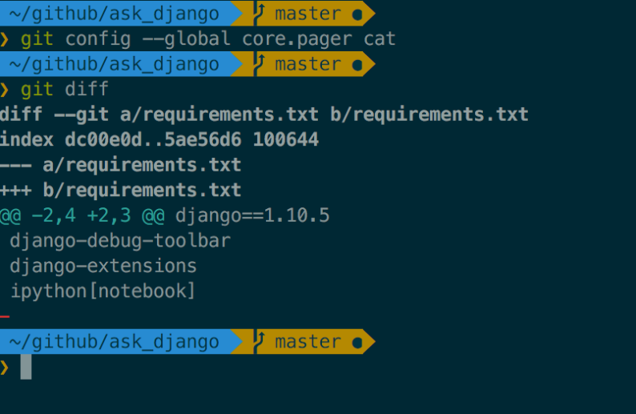

깃은 기본으로 `pager`라는 것을 사용하여 git log, git diff의 결과 화면을 shell에 표시하는데 보기도 힘들고 내용을 다시 확인하기가 힘들다.

기본 설정인 `pager`를 `cat`으로 변경하는 것으로 해결이 가능하다.[해당 정보 관련 링크](http://stackoverflow.com/questions/14004039/leave-git-diff-result-in-the-terminal)

#### git pager 변경

설정은 다음과 같다.

```bash
git config --global core.pager cat
```



### git log 이쁘게 보이도록 변경

```bash
git config --global alias.lg="log --graph --pretty=format:'%C(auto)%h -%d %s %Cgreen(%cr) %C(bold blue)<%an>%Creset' --abbrev-commit --date=relative"
git lg
```

`alias`는 `git lg`로 설정하였다

---

사용 환경은 다음과 같다.

- 터미널 에뮬레이터 : iTerm2
- shell : Zsh
- Zsh 프레임워크 : Oh-my-Zsh!
- Theme : agnoster
- Color : SOLARIZED DARK
- 커스텀 설정 : 사용자명 숨김처리, 멀티라인 적용 ([적용방법](https://wayhome25.github.io/etc/2017/03/12/zsh-alias/))

(추가) ~/.zshrc에 적용한 git alias

```bash
# custom alias 추가
alias gs="git status"
alias gd="git diff"
alias ga="git add"
alias gc="git commit"
alias gp="git push origin master"
```
