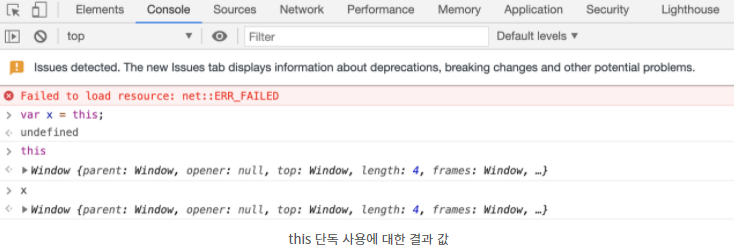
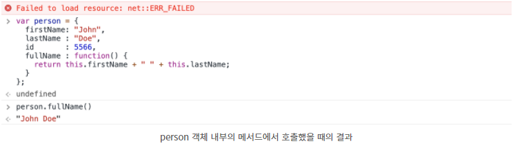
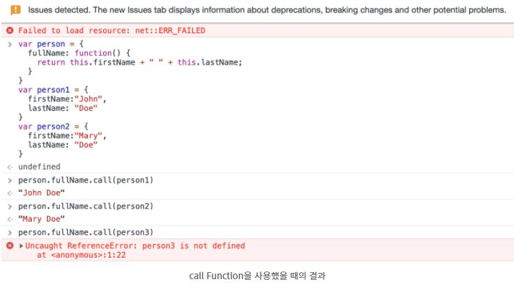

### JS의 `this`란?

[요약]  
작성 시점이 아닌 런타임 시점에 바인딩 되며 함수 호출 당시 상황에 따라 콘텍스트가 결정된다. 함수 선언 위치와 상관없이 `this바인딩`은 오로지 함수를 어떻게 호출했느냐에 따라 정해진다.  
어떤 함수를 호출하면 실행 콘텍스트가 만들어진다. 여기엔 함수가 호출된 callStack과 호출방법, 전달된 인자등의 정보가 담겨있고, `this` 레퍼런스는 그중 하나로 함수가 실행되는 동안 이용할 수 있다.

[상세]
`this` syntax는 this를 사용하는 곳이 속하고 있는 Object(객체)를 나타낸다. 어디서 사용하고 있냐에 따라 `this`가 가리키는 객체는 달라질 수 있다.

#### 단독으로 사용시 browser window의 global Object를 가리킨다.

```js
var x = this;
```

**위와 같이 단독으로 사용시, this는 속하고 있는 객체인 Global Object를 가리킨다. Browser를 사용하고 있다면 [object window]를 가리킨다.**  
실제로 위처럼 window객체를 할당한 후 `x.close()`를 이용하면 창이 닫힌다.

아래는 this 단독사용에 대한 결과값이다.


#### function에서 사용시 browser window의 global Object를 가리킨다.

```js
function myFunction() {
  return this;
}
```

위와 동일.

#### function에서 strict mode를 사용하면 undefined

```js
"use strict";
function myFunction() {
  return this;
}

("use strict");
var y = this;
```

javascript에서 `strict mode`를 사용하면, 이는 default binding을 허용하지 않는다는 의미다. 그리하여 this undefined다.

##### strict mode란?

strict mode는 javascript언어를 좀 더 secure하게 사용하기 위해서 ES5에서 나온 syntax입니다. 예를 들어 기본적인 javascript에서는 var xy = 10; console.log(xx); 와 같이 오타에 대해서 오류로 잡지 않고 결과적으로 undefined라는 결과를 내놓습니다. 이를 비롯하여 strct mode에서는 non-writable property, getter-only property 등이 잘못 사용될 경우 에러를 뱉도록 되어있습니다. 좀 더 자세한 설명은 [link](https://www.w3schools.com/js/js_strict.asp)를 확인하세요.

#### Event 안에서넌 this는 그 이벤트를 받는 element를 나타낸다.

```html
<button onclick="this.style.display='none'">Click to Remove Me!</button>
```

DOM의 eventHandler에 this가 붙으면 해당 이벤트가 일어난 DOM을 나타낸다.
따라서 위 예제는 누른 버튼이 사라지게된다.

#### 객체안의 function(Method)에서 `this`를 사용하면 해당 객체를 가리킨다.

```js
var person = {
  firstName: "John",
  lastName: "Doe",
  id: 5556,
  fullName: function () {
    return this.firstName + " " + this.lastName;
  },
};
```

이때 this는 person 객체를 가리킨다.



#### call(), apply()에서의 this

```js
var person = {
  fullName: function () {
    return this.firstName + " " + this.lastName;
  },
};
var person1 = {
  firstName: "John",
  lastName: "Doe",
};
var person2 = {
  firstName: "Mary",
  lastName: "Doe",
};
person.fullName.call(person1); // Will return "John Doe"
person.fullName.apply(person1); // Will return "John Doe"
```

`Call()` 메서드는 선 정의되는 javascript 메서드다. call()과 method의 내부 변수를 외부에서 가져와서 사용하는 javascript만의 메서드이다.
apply() 또한 call()과 비슷한데 차이점은 [여기](https://www.w3schools.com/js/js_function_apply.asp)서 확인.


