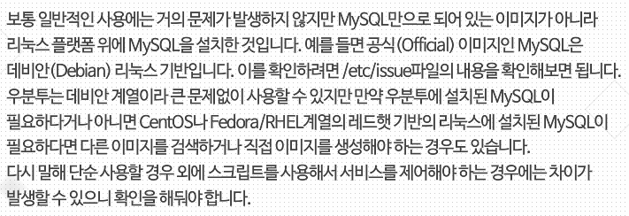

### LXD

- 우분투를 만든 캐노니컬(canonical)에서 만든 컨테이너 솔루션
- 기존의 LXC에 보안개념까지 추가
  - Secure by default
  - Unprivileged container (root가 아니여도 컨테이너 생성가능)
- 도커는 `Application Container`, LXD는 `Machine Container`
- LXD는 `Container "Hypervisor"`
- 도커와는 경쟁기술이라기보다는 보완관계
  - KVM(Kernel Virtual Machine)을 경쟁기술로 간주

#### 특징

1. Secure Design
2. Scalable
   - KVM으로 쓰는것보다 LXD를 사용하는게 더 많은 서버를 띄울 수 있다.
3. Intuitive
4. Image based
5. Live migration
6. KVM보다 빠르다 강조중

#### 도커의 Mysql 이미지를 사용 OS에 무관하게 그냥 사용해도 될까?

