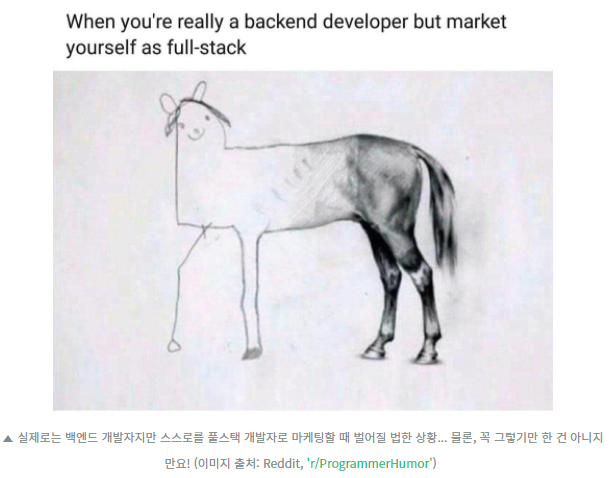
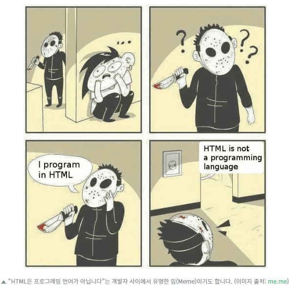
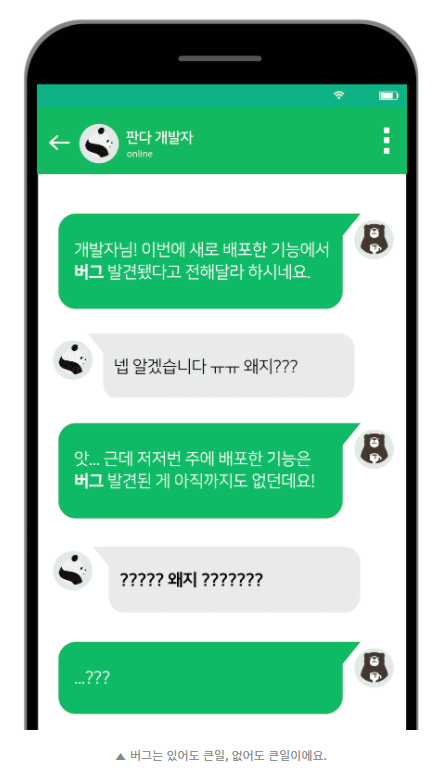
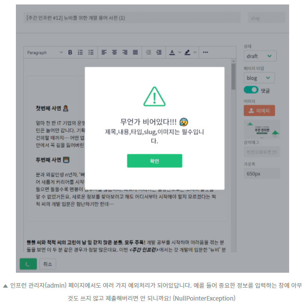
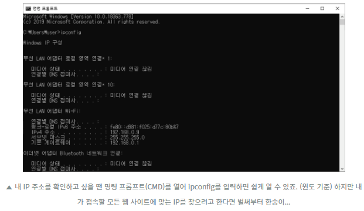

### 프론트엔드 개발자(FrontEnd Developer)

웹 브라우저를 통한 웹 서비스의 앞단을 담당하는 개발자. 클라이언트/서버 기준으로 웹 페이지 화면을 비롯한 클라이언트 영역을 프론트 엔드라고 한다.

### 백엔드 개발자(BackEnd Developer)

웹 서비스의 뒷단을 담당하는 개발자. 주로 유저에게 보이지 않는 DB와 API로 이루어진 서버 영역을 관리 개발한다.

### 풀스택(Full Stack)

  
프론트 엔드와 백엔드 개발영역을 통틀어 다룰 수 있는 개발자. 희귀종, 유니콘, 일당백이 될 수도 있지만 빈 스택(Empty Stack)이 될 수 도 있다.

### 프레임워크(Framework)

프로그램을 개발하기 위한 구조를 제공하는 개발 환경. 코딩 할때 자주 쓰이는 여러 클래스(Class, 변수와 함수의 묶음)를 프레임워크가 정해둔 흐름에 맞춰 쓸 수 있도록 지원해 주기 때문에 복잡하거나 반복되는 작업에 대한 부담을 덜어줄 뿐만 아니라 개발에 들이는 시간 대비 질을 높일 수 있다.  
[ex] 자바스크립트에서는 뷰(Vue.js), 앵귤러(Angular) / 자바에서는 스프링(Spring) - 웹 프레임워크

### 라이브러리(Library)

프로그램을 개발하는 데 필요한 여러 기능을 활용할 수 있도록 묶어놓은 함수 또는 기능의 집합. 프레임 워크는 개발을 제어하는 틀을 제공해준다면, 라이브러리는 개발자가 필요한 기능을 마음대로 가져다 쓸 수 있는 일종의 모음집에 가깝다. 정해진 방식으로 개발을 하게끔 정해주는 프레임워크와 달리 제어권이 개발자에게 주어지는 셈.  
[ex] 자바스크립트에서의 리액트(React), 제이쿼리(jQuery)

### 플러그인(Plug-in)

어떤 특정한 기능을 해결하는 데 쓸 수 있도록 미리 만들어 놓은 코드 및 데이터의 모음. 한 라이브러리나 프레임워크에서 여러개의 플러그인을 제공한다고 볼 수 있다.

### 웹 퍼블리셔(Web Publisher)

디자인 시안에 맞춰 웹 화면을 구현하는 웹 퍼블리싱(Web Publishing)을 담당하는 직무로 한국에서만 쓰인다. 프론트엔드 개발에서 웹 화면과 관련한 시각적인 면을 담당하는 개념을 떼놓은 것.
디자인은 물론 웹 표준과 호환성을 고려해 코딩을 진행하고 디자이너와 프론트 엔드 개발자 사이에서 의견을 조율하기도 한다. 주로 HTML과 CSS, jQuery, Bootstrap 같은 라이브러리나 프레임워크까지 사용하는 편. 마크업 언어인 HTML, CSS를 다루기 떄문에 마크업 개발자라고도 한다.  
같은 퍼블리셔라고 해도 회사마다, 담당하는 일마다 일의 범위가 제각기 다르다. 어떤 회사에서는 프론트엔드 개발자가 퍼블리싱까지 담당하지만 웹 퍼블리셔를 따로 두거나, 디자이너가 웹 퍼블리싱까지 맡는 경우도 많다.

### 마크업 언어(Markup Language)

  
태그 등을 이용해 문서나 데이터의 구조를 표시한 언어. 프로그래밍 언어와는 다르며 HTML, CSS, XML이 대표적인 마크업 언어다.

### 웹 접근성(Web Accessibility)

누구에게나 평등한 웹 환경을 구성하는 요소. 웹 표준을 지킴으로써 장래를 가진 사람, 고령자, 어린이들이 다른 유저들과 마찬가지로 웹에서 제공하는 정보를 원활하게 이용할 수 있도록 보장하는 것.  
[ex] 시각장애인을 위한 대체 텍스트 기능 및 키보드만으로 서비스의 모든 기능을 사용할 수 있도록 하는 것

### 검색 엔진 최적화(Search Engine Optimize)

줄여서 SEO라고 부르며, 웹 페이지를 구글 등 검색엔진이나 포털사이트의 기준에 맞춰 구성하는 작업. 사람들이 많이 검색할 만한 키워드를 배치하고, 웹 표준을 지키며, 스팸으로 분류되지 않게끔 하는 등 웹 페이지 링크가 더 많이 노출되도록 처리한다.  
온라인 마케팅의 필수 요소로도 꼽히는데, SEO가 잘 적용된 페이지는 검색 시 상단에 오를 수 있기 때문이다.

### 버그(Bug)

  
소프트웨어에서 발생하는 예견치 못한 오류나 오작동. 없어도 이상하고 있어도 이상한 것.

### 에러(Error)

잘못 짠 코드처럼 내부 문제로 예상하지 못한 문제가 일어나는 버그와 달리, 외부에 있는 유저가 오탈자를 내거나 띄어쓰기를 실수하는 등 내부에서 정한 형식을 따르지 않을때 주로 발생한다.  
[ex] 숫자만 적도록 되어있는 주민번호 입력창에 문자를 적었을 경우

### 예외(Exception)

  
에러가 일어날 가능성을 개발자가 미리 예상하고 프로그램이 비정상적으로 종료되지 않도록 하는 것. 예외 처리(Exception Handling) 또는 트러블 슈팅(Trouble Shooting)을 통해 예외를 구분하고 유저에게 문제를 바로잡아달라는 에러 메시지를 띄워줘야 에러로 인한 문제를 예방할 수 있다.

### 트래픽(Traffic)

서버를 통해 전송되는 데이터의 양. 서비스 방문자 수가 많을수록, 접속이 잦아질수록 증가한다. 트래픽이 너무 높아지면 서버가 먹통이 된다.(Server Down)  
백엔드 개발자라면 시스템을 안정적으로 개발해 높은 트래픽에도 서비스 접근이 제한되지 않도록 유지하는 것이 관건이다.  
[ex] 수강신청에 서버가 `터져`버리거나, 외부에서 많은 PC를 감염시켜 의도적으로 특정 서비스가 마비되도록 공격하는 것(DDOS)

### 데이터베이스(Database)

줄여서 DB. 데이터의 집합. 서버를 통해 넘어오는 데이터를 저장하고 관리하는 일종의 창고 역할을 한다.
(데이터베이스에 과부하가 걸리면 서버에도 지장을 주고, 관리가 잘못되면 데이터가 날아갈 수 있다.)

### 데이터베이스 관리 시스템(Database Management System)

줄여서 DBMS. 말 그대로 데이터베이스를 통해 데이터를 저장,수정,추출할 수 있도록 관리하는 프로그램.
(MS의 액세스(Access)도 DBMS에 해당한다.)

### 관계형 데이터베이스(Relational DataBase)

데이터베이스에서 키(key)와 값(value)의 관계로 이루어진 표(table)로 데이터를 구성하는 방식. 줄여서 RDB.  
[ex] 오라클, MySQL, Microsoft SQL Server 등

### 쿼리(Query)

RDBMS에서 데이터를 요청하고 관리하기 위해서는 SQL(Structured Query Language, 구조화 쿼리 언어)라는 데이터베이스 언어를 써야 한다. SQL을 이용하면 데이터 베이스에 쿼리(Query), 즉 질의를 통해 원하는 조건에 맞는 데이터를 추출하거나 조작할 수 있다.
`관계형 데이터베이스에서 데이터를 조회, 추출, 조작하기 위해 쓰는 명령어 혹은 질의 자체`를 `쿼리`라고 한다.

### API(Application Programming Interface)

응용 프로그램 인터 페이스. 어떤 응용 프로그램에서 특정한 기능을 사용하기 위해 필요한 데이터를 주고받게끔 만든 도구나 방법을 뜻한다. API가 규격에 맞게 데이터를 요청하고 받아볼 수 있도록 하는 중간 창구 역할을 하는 셈.  
[ex] 포털사이트가 기상 관측 기업의 날씨 정보를 받아서 내보내는 것, 코로나 확진자 분포를 지도에 띄우는 것, 여러 웹사이트에서 페이스북이나 카카오톡 계정을 통한 간편 로그인을 제공하는 것

### 오픈소스(Open Source)

  
누구나 제한 없이 쓸 수 있는 소스 코드 혹은 소프트웨어. 오픈 소스로 배포된 코드는 열람, 수정, 복제, 재배포 등이 자유롭다.
한국에서는 [공공데이터포털](data.go.kr)을 통해 공개된 오픈 API를 내려 받을 수 있다.

### SDK(Software Development Kit)

소프트웨어나 시스템을 만드는 데 쓰이는 개발 도구 키트. SDK안에는 개발에 필요한 샘플 코드, 코드 편집기 같은 툴이나 콘솔, 안내 문서, API등이 포함된다.  
[ex] 안드로이드용 모바일 앱을 개발하는 데는 Android SDK, 자바 개발을 하는데는 JDK가 쓰인다.

### IDE(Integrated Development Environment)

프로그램을 개발하는 데 필요한 소스 코드 작성 및 편집, 컴파일, 디버깅 등 모든 작업을 한번에 할 수 있는 통합 개발 환경.  
[ex] 비주얼 스튜디오(Visual Studio), 이클립스(Eclipse), 인텔리제이(IntelliJ) 등

### 유닉스(Unix)

기계어에 가까운 언어인 어셈블리어로 개발한 컴퓨터 운영 체제. 주로 서버 개발이나 시스템 개발에 쓰이며, macOS나 리눅스, 안드로이드 등 오늘날 많은 운영체제의 원형

### 리눅스(Linux)

  
유닉스 계열에 속하는 오픈소스 운영체제. 서버 개발 및 구축, 슈퍼컴퓨터, 임베디드 기기, 스마트폰 OS 개발 등 다양한 용도로 활발하게 사용되고 있다.  
[ex] 리눅스를 개량해서 만든 배포판은 우분투와 데비안이 대표적이다.

### 쓰레드(Thread)

프로그램을 실행하는 하나의 프로세스(Process) 내에서 실제로 작업을 처리하는 주체를 뜻한다. 모든 프로세스는 반드시 한 개 이상의 쓰레드를 가진다.

### 멀티쓰레드(Multi Thread)

하나의 프로세스가 두 개 이상의 쓰레드를 가지는 경우. 프로세스 내에 이쓴 각각의 쓰레드가 프로세스 메모리를 공유하기 때문에 자원을 절약할 수 있고, 쓰레드간 정보교환이 쉽다는 장점이 있다.

### 도메인(Domain)

숫자로만 이루어진 IP와 달리 `naver.com`처럼 문자로 지정된 인터넷 주소(URL)

### DNS(Domain Name System)

  
도메인을 도메인이 올라가 있는 웹 서버의 IP로 연결하는 시스템. 웹 페이지에 접속하기 위해 필요한 IP를 일일이 챙길 필요 없이 도메인과 IP를 변환해주는 역할을 한다.

### 프로토콜(Protocol)

컴퓨터나 서버, 통신 장비 등 장치 사이에서 서로 통신하기 위해 미리 정해놓은 규칙.  
[ex] TCP/IP, HTTPS, HTTP

### HTTP, HTTPS

`HTTP`는 하이퍼 텍스트 전송 프로토콜(Hypertext Transfer Protocol)의 약자로 네트워크에서 HTML 문서를 주고받기 위한 통신규약이다. `HTTPS`는 HTTP가 가진 보안 취약점을 암호화 및 인증 구조를 통해 개선하기 위해 만들어졌다.(보안 소켓 레이어(SSL, Secure Socket Layer) 개념을 덧붙인것)

### 동기(Sync) vs 비동기(Async)

`동기(Synchronous)`는 기능에 대한 요청을 보내고 응답을 받아야만 동작이 순차적으로 처리되는 방식이며, `비동기 방식(Asynchronous)`은 요청을 보내는 순서와 상관없이 동작이 처리되는 방식이다.

### AJAX(Async JavaScript and XML)

비동기적 자바스크립트와 XML의 약자로, 한 페이지를 로딩할 때 페이지의 일부 데이터만을 갱신하는 웹 개발 기법을 뜻한다.  
기존 웹 페이지 로딩 방식은 한 웹사이트 내부에서 페이지를 넘겨 이동할 때마다 다른 웹페이지를 서버에서 통쨰로 불러오기 때문에 시간이 오래 걸리는 단점이 있었지만, AJAX는 웹페이지의 기본적인 디자인 틀을 갖춰놓은 뒤 자바 스크립트를 통해 웹 서버에 필요한 데이터를 요청하고 디자인 틀 안에서 XML로 이루어진 데이터를 불러와 변경한다.  
즉 전체를 로딩할 필요 없이 일부분만 불러오기 때문에 우베 페이지를 처리하는 속도가 빨라지고 코드의 양도 줄어든다는 장점이 있다.

### 정적 웹 페이지(Static Web page)

서버에 미리 저장된 데이터를 그대로 불러오듯 전달하는 웹 페이지. 서버의 데이터가 바뀌지 않는 한 모든 사용자는 늘 고정된 웹페이지를 받아보게 된다. 주로 서비스 소개페이지처럼 내용이 자주 변경되지 않는 경우 자주 사용한다.

### 동적 웹 페이지(Dynamic Web Page)

정적 웹 페이지와 반대로 서버에 저장된 데이터를 그대로 보여주는 것이 아니라 스크립트를 통해 가공을 거쳐 출력하는 웹페이지.  
(매번 새롭게 정보가 갱신되는 게시판, SNS처럼 결과가 그때그때 바뀐다면 전부 동적웹이다.)

### 적응형 웹(Adaptive Web Design)

미리 웹 브라우저가 동작할 기기 별로 레이아웃을 여러개 정해놓고 조건에 따라 그중 하나를 보여주는 웹 디자인 방식.

### 반응형 웹(Responsive Web Design)

[인프런 반응형 웹](https://cdn.inflearn.com/public/files/pages/da31b8e6-b18f-4629-93e4-17fe99f9d575/vol13-2.gif)

적응형 웹과 달리 하나의 레이아웃이 웹 브라우저에 맞춰지는 형태로 웹 브라우저의 가로폭이 바뀔 때마다 페이지 내에 있는 콘텐츠의 크기와 배치도 자동으로 맞춰진다.

### 인터랙티브 웹(Interactive Web)

[BBC 페이지](https://cdn.inflearn.com/public/files/pages/22ae6a7f-c7ea-4983-bcce-2e260ed69ebd/vol13-3.gif)

([BBC에서 인터랙티브 웹을 적용했다.](https://www.bbc.com/korean/resources/idt-48d3c9a7-4063-4289-9726-611b5ea9d7b5) 애플도 비슷하게 되어있음.)  
웹페이지 내의 콘텐츠가 클릭, 스크롤, 입력 등 사용자의 동작에 따라 상호작용 하는 웹페이지.

### MEAN vs. MERN vs. MEVN

[풀스택 기술스택](https://cdn.inflearn.com/public/files/pages/0e9501bd-6d65-4731-97ad-df84fc7f4d93/vol13-4.png)

풀스택 웹 개발을 할 수 있는 대표적인 기술 스택.  
`M`은 DB인 MongoDB, `E`는 서버개발에 필요한 Express.js, `N`은 자바 스크립트를 실행할 수 있게 해주는(런타임) Node.js를 가르킨다. 여기에 프론트엔드를 담당하는 프레임워크 혹은 라이브러리만 각각 앵귤러(Angular; MEAN), 리액트(React; MERN), 뷰(Vue.js;MEVN)로 나뉘는 것이다. 자바스크립트 언어만으로도 풀스택 개발을 할 수 있다는 이유 떄문에 풀스택 개발자가 되고 싶은 사람들 사이에 인기가 많은 기술 스택이다.

### CDN(Content Delivery Network/Content Distribution Network)

한국어로 번역하면 콘텐츠 전송 네트워크. 멀리 떨어진 사용자에게 컨텐츠를 더 빠르게 제공할 수 있도록 하는 기술이다. 원 서버에서 사용자에게 직접 콘텐츠를 전송하는 대신, 사용자와 가까운 서버로 데이터를 분산시켜 제공하는 네트워크 시스템을 말한다.

### 캐시(Cache)

DB, Server, Session 등 다양한 장치에서 널리 쓰이는 개념으로 사용자가 데이터에 빠르게 접근할 수 있도록 데이터를 임시로 저장해둔 장소. 이것을 활용하는 것을 캐싱(Caching) 이라고 한다.
CDN 역시 웹 컨텐츠를 캐싱한 데이터를 사용자에게 전달함으로써 데이터를 더 빠르게 더 많이 전송하는 기술이다.

### 브라우저 캐싱(Browser Caching)

웹페이지에 방문했을때 페이지를 이루는 이미지나 HTML, CSS문서 등 일부 데이터를 사용자의 PC에 저장해둔 뒤, 페이지를 재방문했을 때 서버에 요청할 필요없이 PC에 저장했던 데이터를 불러오는 캐싱 기술.

### 세션(Session)

웹 브라우저를 통해 서버에 접속해 연결을 끊기 전까지(=브라우저를 종료하기 전까지) 사용자가 요청하는 상태 정보를 서버에서 일정하게 유지하는 기술. 한 사이트 내에서 페이지 이동할 때마다 로그인이 끊기지 않도록 하는게 대표적 예다.

### 쿠키(Cookie)

서버에 저장되는 세션과는 달리 사용자의 브라우저에 간단한 Key, Value 구조로 저장되는 작은 데이터. 브라우저에 ID나 암호를 저장하거나 사이트 방문기록을 저장하는 데 주로 쓰인다.

### UX(User eXperience)

사용자가 서비스를 이용하며 느끼고 얻는 경험.

### UI(User Interface)

사용자가 서비스를 이용하는 환경. UI는 사용자 경험(UX)에 큰 영향을 미친다.

### GUI(Graphic User Interface)

그래픽 유저 인터페이스. 사용자가 화면 안의 요소를 시각적으로 확인하고 마우스로 아이콘을 클릭해 기능을 작동시키는 환경. 도스의 CLI(Command-Line Interface)에 반대되는 개념.

### 모달(Modal Window)

UI 디자인 요소로 웹페이지나 프로그램 화면에서 대화상자 형태로 나타나 사용자에게 동작을 요구하는 창이다. 팝업과 비슷하지만 브라우저를 새로 띄우는 팝업과 달리 브라우저 화면 내부에서 레이어를 한 겹 얹듯이 새 창을 보여준다.

### 임베디드(Embedded)

특정 기능을 수행하는 전자시스템을 내장해 놓은 것. 임베디드 시스템은 각종 가전제품, TM, 개표기, 키오스크 등 특수한 목적에 따라 기능을 수행하도록 제작된다. OS는 보통 간소한 형태(ex:임베디드 리눅스)로 탑재되거나 생략되며 낮은 전력으로도 정교한 기능을 실시간으로 처리할 수 있게끔 하는게 핵심이다.

### 펌웨어(Firmware)

하드웨어를 제어하는 소프트웨어. 하드웨어가 출고될 떄부터 포함되어있는(임베디드) 프로그램인 만큼 하드웨어보다는 교체하기 쉽지만 일반적인 소프트웨어에 비해서는 어렵기 때문에 soft도 hard도 아닌 그 중간쯤의 firm이라는 이름이 붙었다.

### 알고리즘(Algorithm)

[알고리즘 예시](https://cdn.inflearn.com/public/files/pages/74db504e-7e80-46bf-a959-c02654bd269c/vol13-9.png)

문제를 해결하기 위해 필요한 계산 절차. 프로그래밍 언어를 통해 알고리즘을 프로그램으로 만들어 가는 작업을 프로그래밍이라고 한다.

### 자료 구조(Data Structure)

데이터를 효과적으로 접근할 수 있도록 만들어진 데이터 체제로, 코드상에서 자료를 저장하는 방법, 자료끼리의 관계 등을 구조적으로 표현하는 방식이다. 어떤 자료구조를 쓰냐에 따라 코드 효율이 달라진다.

### 디버깅(Debugging)

프로그래밍 과정에서 발생하는 버그를 찾아 바로 잡는 작업. 단순히 버그를 없애는 것뿐만 아니라 문제가 발생한 근본적인 원인을 찾아 해결하는 과정이다.

### 리팩토링

이미 완성된 코드의 구조를 개선하는 일. 결과값은 바뀌지 않지만 코드 내부를 뜯어고쳐 다름사람이 이해하기 쉽고 간결하게 만드는 행위. 코드의 생산성을 높이고 유지보수가 쉽게끔 만들어준다.

### 코딩 컨벤션(Coding Convention)

지키지 않으면 훗날 다른사람이 피 보는 것. 여러 개발자가 협업하는 과정에서 서로의 코드를 파악하고 관리하기 쉽도록 일관적인 스타일을 유지하게끔 하는 코드 작성 규칙. 띄어쓰기나 들여쓰기 함수나 변수 이름을 지정해주는 방법 등 정해진 코딩 컨벤션을 준수해야 통일된 코드를 짤 수 있다.

### 기술 부채(Technical Debt)

불확실한 업무, 촉박한 일정에 맞춰 제한된 방법으로 개발을 진행하면서 문제점이 누적된다는 관점. 프로젝트에 대해 정리된 문서를 마련하지 못하거나, 조악한 코드로 작업을 계속하게 되거나, 자동화할 수 있는 일에 대한 자동화 처리를 해놓지 않는 등 다양한 상황에서 기술 부채가 쌓일 수 있다. 마치 이자가 붙듯이 시간이 지나면 지날수록 해결이 까다로워지는 만큼 말 그래도 기술적으로 빚을 지는 셈. 대신 완전히 피할수는 없으니 관리할 수 있는 선에서 기술 부채를 유지하고 작업을 추진해나가는게 필요하다.

### 컴파일(Compile), 컴파일러, 컴파일 언어

사람이 이해할 수 있는 고급 프로그램이 언어로 작성한 코드를 컴퓨터가 처리할수 있는 기계어로 한꺼번에 번역하는 과정을 컴파일(Compile)이라고 하는데, 이때 쓰이는 프로그램 또는 시스템이 컴파일러다. 수정이 까다롭지만 프로그램 실행 속도가 빠르다는 장점이 있다. C, C++이 대표적인 컴파일 언어.

### 인터프리트(Interpret), 인터프리터, 인터프리티드 언어

인터프리트(interpret)는 컴파일과 달리 프로그램을 실행할 때마다 고급 프로그래밍 언어로 작성된 코드를 한 줄씩 기계어로 번역하는 방식이다. 한줄씩 코드를 실행해 내려가기 때문에 실행속도는 느리지만 디버깅은 쉽다. Javascript, Java, Python, PHP 등이 해당 언어에 속한다.

### Git

프로젝트 결과물을 버전별로 백업, 관리하는 툴인 버전관리 시스템(VCS, Version Control System)의 한 종류다.

### GitHub

깃을 기반으로 소스코드를 온라인에 저장하고, 공유할 수 있게끔 하는 소스코드 관리 서비스이다. 언제 어디서나 깃헙을 통해 협업 프로젝트를 쉽게 관리할 수 있으며, 전세계의 다양한 오픈소스가 깃허브를 통해 공개되고 있다.

### 레포지토리(Repository)

저장소. 파일이나 폴더 등 각종 정보를 저장해두는 공간으로, 깃허브를 통해 개인 또는 팀을 위한 공개/비공개 리포지터리를 무료로 만들 수 있다. Repo로 줄여 부르기도 한다.

### 커밋(Commit)

깃에서 코드에 대한 수정사항을 기록하는 명령.

### 스택오버플로우

세계에서 가장 큰 개발자 웹 커뮤니티 중 하나로, 프로그래밍에 대한 다양한 질문/답변이 올라온다. **갓갓사이트**
